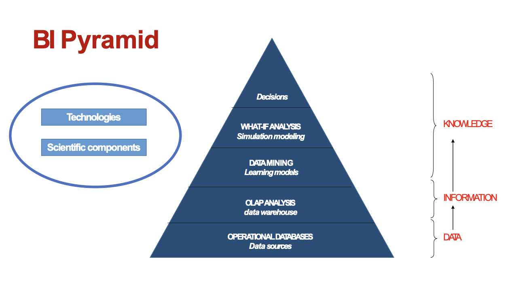
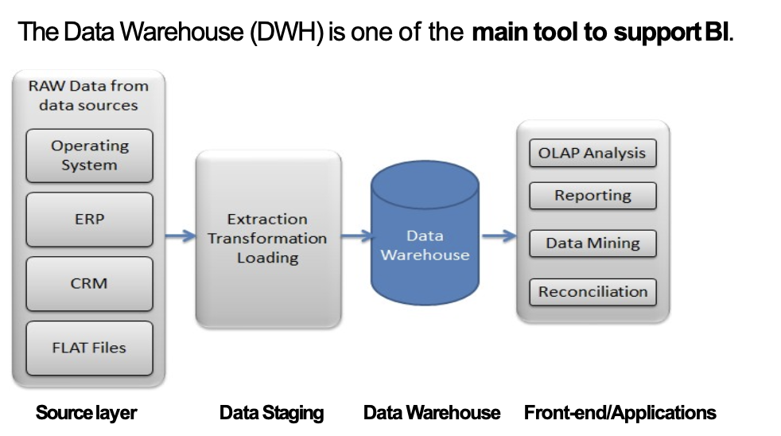
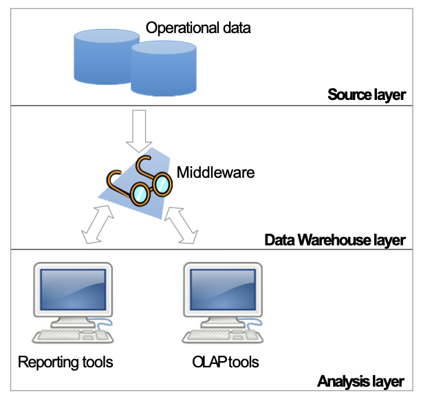
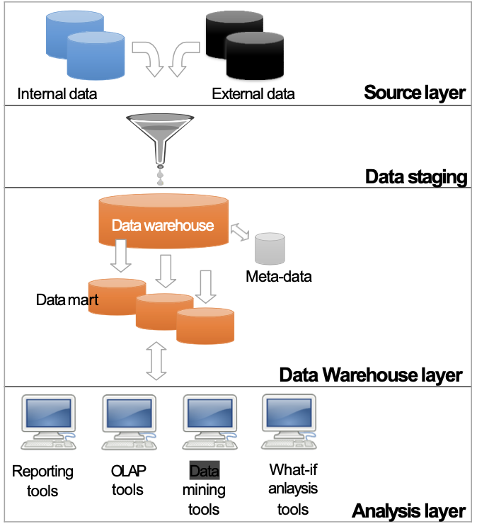
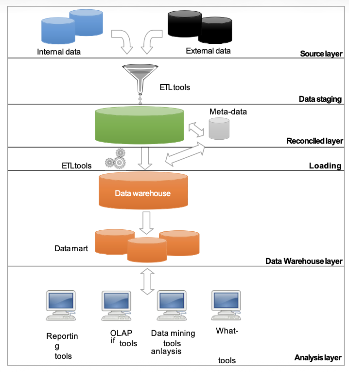

# Machine Learning and Data Mining 

## Course Information
**Instructor**: Claudio Sartori  
**Department**: DISI (Department of Computer Science and Engineering) - University of Bologna, Italy

### Reference Materials
- **[Alpaydin, 2014]**: Theoretical machine learning
- **[Hastie et al., 2009]**: Statistical learning foundations  
- **[Witten et al., 2016]**: Practical textbook with Weka software

## Introduction to Machine Learning and Data Mining

### Historical Context
- **1960s**: Early data collections and databases
- **1970s**: Early database management systems  
- **1980s**: DBMS maturity, early data insights attempts
- **1990s**: Web, data warehousing, knowledge discovery
- **2000s+**: Big data explosion

### Key Concepts
**Statistics** (since 18th century):
- Descriptive, inferential, statistical models

**Machine Learning** (since late 1950s):
- "Field of study that gives computers the ability to learn without being explicitly programmed"
- Learning by being told vs. learning from examples

**Data Mining** (since early 1990s):
- "Computational process to discover patterns in data"
- Uses concepts from: artificial intelligence, machine learning, statistics, DBMS technology
- Data-driven approach

### Terminology
- **Business Intelligence**: Analyze massive data for business purposes
- **Analytics**: Draw specific conclusions from raw data
- **Data Mining**: Entire discovery process from data to actionable patterns
- **Machine Learning**: Methods/algorithms to extract patterns from data
- **Data Science**: Broader term encompassing all above areas

### The Data Challenge
"We are drowning in data and starved for information" - Data explosion creates distance between data generation and comprehension.

## Real-World Examples

### Soybean Diseases [Michalski and Chilausky, 1980]
- **Problem**: Diagnose 19 soybean diseases using 35 attributes from 307 cases
- **Expert Rules**: 72% accuracy, difficult to elicit and maintain
- **Machine Learning**: 97.5% accuracy using learned rules from examples
- **Key Insight**: Learning from examples outperformed rule-based expert systems

### Wal-Mart Hurricane Frances [Provost and Fawcett, 2013]
- **Scenario**: Predict product demand before hurricane landfall
- **Approach**: Mine data from previous hurricane (Charley) to identify unusual demand patterns
- **Findings**: 
  - Strawberry Pop-Tarts: 7× normal sales rate
  - Beer: Top-selling pre-hurricane item
- **Value**: Proactive stocking based on data patterns rather than obvious assumptions

### General Application Areas
- **Decision Support**: Market analysis, risk management, fraud detection
- **Data Analysis**: Text mining, social mining, image analysis  
- **Prediction**: Power requirements, weather forecasting
- **Diagnostics**: Predictive maintenance, healthcare

### Core Data Mining Tasks

#### 1. Classification & Class Probability Estimation
- Predict categorical outcomes
- *Example*: Which customers will respond to an offer?

#### 2. Regression (Value Estimation)
- Predict numeric values
- *Example*: How much will a customer use a service?

#### 3. Similarity Matching
- Identify similar individuals
- *Example*: Find companies similar to best customers

#### 4. Clustering
- Group individuals based on similarities
- *Example*: Cluster DNA sequences into functional groups

#### 5. Co-occurrence Grouping (Association Rules)
- Find items that frequently appear together
- *Example*: Market basket analysis

#### 6. Profiling (Behavior Description)
- Describe typical behavior patterns
- *Example*: Cell phone usage by customer segment

#### 7. Link Analysis
- Infer connections in graph data
- *Example*: Social network friend recommendations

#### 8. Data Reduction
- Reduce dataset size while preserving key information
- Trade-off between information loss and improved insight

#### 9. Causal Modeling
- Understand cause-effect relationships
- *Applications*: Marketing effectiveness, healthcare treatments, policy interventions

### Learning Categories

#### Supervised vs. Unsupervised Learning
- **Supervised**: Target variable defined (e.g., churn prediction)
- **Unsupervised**: No specific target, patterns emerge naturally (e.g., customer segmentation)
- **Not a design choice**: Determined by problem and data characteristics

#### Sources of Supervision
- Expert-provided labels (e.g., disease diagnoses)
- Historical data (e.g., past customer behavior)

#### Reinforcement Learning
- Learn optimal action sequences through trial and reward
- Focus on overall policy rather than single actions

## Data Fundamentals

### What is a Dataset?
**Narrow view**: 
- $N$ individuals × $D$ attributes = relational table with $N$ rows and $D$ columns

**Broader view**:
- Real-world data rarely perfectly structured
- Most ML techniques require relational table format
- Data transformation often necessary

### Field Relationships
$$
\text{Artificial Intelligence} \supset \text{Machine Learning} \supset \text{Deep Learning}
$$
$$
\text{Machine Learning} \supset \text{Reinforcement Learning}
$$

*Note: Diagram shows logical inclusions, not relative importance*

---

# Business Intelligence, Data Warehousing, and Dimensional Fact Model

## 1. Business Intelligence (BI)

### Definitions
**Gartner**: "Business intelligence (BI) is an umbrella term that includes the applications, infrastructure and tools, and best practices that enable access to and analysis of information to improve and optimize decisions and performance."

**Forrester Research**: "Business Intelligence is a set of methodologies, processes, architectures, and technologies that transform raw data into meaningful and useful information used to enable more effective strategic, tactical, and operational insights and decision-making."

**Our Definition**: Process of transforming raw data into useful information to support effective business strategies, delivering the right information to the right **people**, at the right **time**, through the right **channel**.

## 2. Data Warehousing (DWH)

### Key Features
- **Subject-oriented**: Focuses on enterprise concepts (customers, products, sales)
- **Integrated and consistent**: Unifies data from heterogeneous sources
- **Time-variant and non-volatile**: Tracks changes over time, data is never overwritten

### DWH vs Operational Databases
| Feature | Operational Databases | Data Warehouses |
|---------|---------------------|-----------------|
| Users | Thousands | Hundreds |
| Workload | Preset transactions | Specific analysis queries |
| Workload type | Short, frequent operations | Long, complex queries |
| Data updates | Continuous inserts/updates/deletes | Periodic batch loads (ETL) |
| Optimization | For transaction throughput (OLTP) | For query performance (OLAP/BI) |
| Schema design | Highly normalized (3NF) | Denormalized, star/snowflake schemas |
| Access | Read/write few records | Read-only millions of records |
| Goal | Application support | Decision-making |
| Data | Detailed, mixed types | Aggregated, mainly numeric |
| Time coverage | Current data only | Current + historical data |
| Model | Normalized | Denormalized, multidimensional |

## BI and Data Warehouse Relationship

- **Data Warehouse (DWH)** serves as a primary tool supporting Business Intelligence
- **Informal definition**: Optimized repository storing information for decision-making processes
- **Classification**: Specific type of Decision Support Systems (DSSs)

**Business Need**: Growing data volumes require more sophisticated solutions than operational databases for strategic business analysis.

## Advantages of Data Warehouse Systems

- **Historical Data Management**: Ability to store and manage historical data sets
- **Multidimensional Analysis**: Enables accurate and rapid multidimensional analyses
- **User-Friendly Model**: Simple model that users can easily learn and understand  
- **Indicator Foundation**: Basis for calculating business performance indicators and metrics

## Key Data Warehouse Features

A Data Warehouse is a specialized data collection supporting decision-making with these characteristics:

### 1. Subject-Oriented
- Focuses on enterprise-specific business concepts
- Examples: customers, products, sales, inventory

### 2. Integrated and Consistent
- Unifies data from diverse, heterogeneous sources
- Provides single, coherent view across all organizational data

### 3. Time-Variant and Non-Volatile
- **Time Evolution**: Tracks and records data changes over time
- **Historical Reporting**: Enables trend analysis through historical reports
- **Data Preservation**: Data is never overwritten or deleted once committed
- **Static Nature**: Read-only data retained for future analysis and reporting

## Multidimensional Model & OLAP

### Core Concept
The multidimensional model represents data as:
$$
\text{Quantity sold} = 4,\ \text{Profit} = 25€
$$

**Dimensions**: Shop, Date, Product (forming the analysis axes)

### OLAP Capabilities
- **Interactive Navigation**: Users explore data warehouse information through multidimensional model
- **Aggregation Levels**: Data analyzed at different granularity levels
- **Operator Application**: Sequential OLAP operators generate multiple query perspectives
- **Dynamic Analysis**: Enables flexible, ad-hoc business intelligence exploration

This multidimensional approach forms the foundation for advanced analytical processing that drives informed business decision-making.
### Data Mart
Subset of DWH focused on specific business area, department, or user group. Used as building blocks for incremental DWH development.

## 3. OLAP (Online Analytical Processing)

### OLAP vs OLTP
- **OLTP**: Transaction-based, reads/writes few records
- **OLAP**: Multidimensional analysis, processes huge amounts of data

### OLAP Operators
- **Roll-up**: Increases data aggregation, removes detail level
- **Drill-down**: Decreases data aggregation, adds detail level
- **Slice-and-dice**: Reduces dimensions by setting specific values
- **Pivot**: Changes layout for different viewpoints
- **Drill-across**: Links interrelated cubes for comparison
- **Drill-through**: Switches from aggregate to operational data

## 4. ETL Process (Extraction, Transformation, Loading)

### Extraction Types
- **Static**: Initial snapshot of operational data
- **Incremental**: Regular updates based on timestamps/triggers

### Data Cleansing
Problems addressed:
- Duplicate data
- Missing data  
- Unexpected field usage
- Impossible/wrong values
- Inconsistent values

### Cleansing Techniques
- **Dictionary-based**: Lookup tables for abbreviations/synonyms
- **Approximate merging**: Join without common key using similarity functions
- **Ad-hoc algorithms**: Custom business rules

### Transformation Categories
- **Conversion**: Data type/format changes
- **Enrichment**: Combine attributes to create new information
- **Separation/Concatenation**: Attribute manipulation

### Loading Methods
- **Refresh**: Complete DWH rewrite
- **Update**: Add only changes to existing data

## 5. Data Warehouse Architectures

### Single-Layer
- Only source layer physically available
- DWH as multidimensional view via middleware
- **Pros**: Minimal space, **Cons**: No separation of analytical/transactional processing

### Two-Layer
- Physical separation of sources and DWH
- Layers: Source → Data Staging → Data Warehouse → Analysis (accessed by end-users)

### Three-Layer
- Adds **Reconciled Layer**: Integrated, consistent, correct operational data
- Creates common reference data model for enterprise

## 6. Dimensional Fact Model (DFM)

### Basic Concepts
| Concept | Description | Example |
|---------|-------------|---------|
| **Fact** | Relevant decision-making concept | Sales, purchases, orders |
| **Measure** | Numerical fact property | Quantity, revenue, discount |
| **Dimension** | Fact property with finite domain | Date, product, store |
| **Hierarchy** | Tree of dimensional attributes | Date→Month→Year |

### Event Types
- **Primary Event**: Specific occurrence identified by dimension values
- **Secondary Event**: Aggregation of primary events based on dimensional attributes

### Measure Additivity
A measure is called additive along a dimension when you can use the SUM operator
to aggregate its values along the dimension hierarchy . If this is not the case, it is called
non-additive. A non-additive measure is non-aggregable when you can use no
aggregation operator for it.
| Measure Type | Temporal Hierarchies | Non-temporal Hierarchies |
|-------------|---------------------|-------------------------|
| **Flow measures** | SUM, AVG, MIN, MAX | SUM, AVG, MIN, MAX |
| **Level measures** | AVG, MIN, MAX | SUM, AVG, MIN, MAX |
| **Unit measures** | AVG, MIN, MAX | AVG, MIN, MAX |

### Aggregation Operators
- **Distributive**: Calculate from partial aggregates (SUM, MIN, MAX)
- **Algebraic**: Require finite support measures (AVG)
- **Holistic**: Require infinite support measures (RANK)

### Advanced DFM Concepts
- **Descriptive attributes**: Additional information not used for aggregation
- **Cross-dimensional attributes**: Defined by combination of multiple dimensions
- **Convergence**: Multiple paths to same dimensional attribute
- **Shared hierarchies**: Attributes shared across hierarchies
- **Multiple arcs**: Many-to-many associations
- **Optional arcs**: Associations not defined for all events
- **Incomplete hierarchies**: Missing aggregation levels
- **Recursive hierarchies**: Parent-child relationships

## 7. Logical Design

### Star Schema
- Fact table + denormalized dimension tables
- Optimized for query performance

### Snowflake Schema
- Partially normalized dimension tables
- Reduces redundancy but increases joins

The DFM provides a conceptual foundation that can be implemented as either star or snowflake schemas based on specific requirements and performance considerations.