> 
> **Subject**: ML slides pack - data, classification1 and classification2 by Claudio Sartori
>
> **Course:** Artificial Intelligence - LM
> 
>**Department**: DISI (Department of Computer Science and Engineering) - University of Bologna, Italy
>
> **Author**: Roberto Zanolli
> 
> **TIPS**
> - w.r.t means "with respect to"
# Data
## Data types

Data can be categorized along several dimensions:

- **Quantitative**: Numerical data (continuous or discrete)
- **Qualitative**: Categorical data (nominal or ordinal)
- **Structured**: Organized in predefined formats (tables, databases)
- **Unstructured**: No predefined organization (text, images, audio)


"description" and "descriptive statistics" sums while descending (Ordinal has everything in Nominal, plus its own and so on).

**Discrete domains**
- allow a finite number of values (or infinitely countable)
- codes, counts, ...
- special case: binary attributes
- special case: identifier

**Continuous domains**
- floating point variables
- nominals and ordinals are discrete, possibly binary
- intervals and ratio are continuous
- counts are discrete and ratio

## Data quality 
***"Data are never perfect"***
###  Main problems
- **Missing values**: Incomplete data records (lot of nulls)
- **Inconsistent data**: Contradictory information across sources
- **Duplicated entries**: Redundant data instances
- **Wrong values**: Incorrect or inaccurate data
- **Outliers**: Small amounts of data that significantly differ from the rest (can be due to error during measurement, data entry errors, or genuine variability)

### Outliers
- Represent anomalies or errors in the dataset
- Some machine learning techniques are more **robust with respect to errors** than others
- Detection and handling crucial for model performance

**Key point**:  $\text{Better data quality} \Rightarrow \text{Better results}$

**Critical principle**: $Garbage-in–Garbage-out$
- Poor quality input data inevitably leads to poor model performance
- **No algorithm can compensate for fundamentally flawed data**

--- 
## More on data types

### Interval data vs ratio data
Interval **does not preserve relative value upon scale change**


### Data transformations
Not all transformations are allowed according to the data type


## Asymmetric attributes
- ***We only care if it is not null (only interested if the value is present)***

## **General characteristics of data sets**

### **Dimensionality**
*   The difference between having a small or a large (hundreds, thousands, ...) number  of attribute is also qualitative
### **Sparsity**
*   Sparsity means that there are many zeros or nulls
*   Some databases stores the nulls as zeros or placeholders value (still irrelevant and noisy)

### **Resolution**
*   Greatly influences the results
*   The analysis of too detailed data can be affected by noise
*   The analysis of too general data can hide interesting patterns

### **Record data**

- **Tables**
	*  e.g. relational databases (also dataframes)
- **Transaction**
	*  a row is composed by: TID + set of Items
	* e.g: { id: 1, bought: [hairdryer, facemask...]}
- **Data matrix**
	*  numeric values of the same type
	*  a row is a point in a vector space
- **Sparse data matrix**
	*  asymmetric values of the same type
- Graph data
	- e.g: all XML-like files like html pages
## Noise
- Original data are **modified** or there is a **mix of interesting and uninteresting** data

## Outliers
**Outlier** = data whose characteristics are considerably different from most of the data in the dataset. 


#### **IQR - InterQuartile Range**

$Q1$: first quartile, $Q3$: third quartile,

>$IQR = Q3 - Q1$
>
>$Lower$  $boundary$ $= Q1 - IQR \times 1.5$
>
>$Upper$ $boundary$ $= Q3 + IQR \times 1.5$

*Consider outlier the values out of the whiskers*
The upper whisker will extend to last datum less than $Q3 + 1.5 \times IQR$

---
#  Classification
**Unsupervised Classification**

- The unsupervised mining techniques which can be in some way related to classification are usually known in literature with names different from classification

- **Classification** = supervised classification

## Soybean example

**The Data Set**

- The data set $X$ contains $N$ individuals described by $D$ attribute values each
- We have $Y$ vector which, for each individual $x$ contains the class value $y(x)$ (labels)
- The class allows a finite set of different values (e.g. the diseases), say $C$
- The class values are provided by experts: the supervisors
- We want to learn how to guess the value of the $y(x)$ for individuals which have not been examined by the experts

## Definition of classification model

- **An algorithm which, given an individual for which the class is not known, computes the class**
- The algorithm is parametrized to optimize results for the specific problem

**Development Process:**
1. Choose the learning algorithm
2. Let the algorithm learn its parametrization
3. Assess the quality of the classification model

**Usage:**
- The classification model is used by a run-time classification algorithm with the developed parametrization

### Formal definition

**Decision function:**
$$M(x, \theta) = y(x)_{pred}$$
**Where:**
- $x$: data element with unknown class label $y(x)$
- $\theta$: set of parameter values for the decision function
- $y(x)_{pred}$: predicted class

**Learning Process:**
Given classifier $M(.,.)$, dataset $X$, and supervised labels $Y$, determine $\theta$ to **minimize** prediction error.

##### Example
For simple domain we can use a straight line as decison function.

We can see that it makes mistakes.
It's normal, every classifier makes mistakes (even with the best fit for parameters)

## **Vapnik-Chervonenkis Dimension**

*Given a dataset with $N$ elements there are $2^N$ possible different learning problems.*
If a model $M(.,.)$ is able to shatter **all** the possible learning problems with $N$ elements, we say that it has **Vapnik-Chervonenkis** Dimension equal to $N$.

**The straight line has VC dimension 3.**


*example of a classification workflow*

### Different types of classificators
- CRISP
	- the classifier assigns to each individual one label
- Probabilistic
	- the classifier assigns a probability for each of the possible labels


## Decision Trees
##### Main strength
Good compromise: decent performance, fast to train and execute, easy to understand

### **Decision Tree Structure**
A run-time classifier structured as a decision tree is a **tree-shaped set of tests**.
The decision tree has:
- **Inner** nodes
- **Leaf** nodes


### Learning a decision tree – Model generation

Given a **set $X$ of elements** for which the class is known, grow a decision tree as follows:

- If all the elements belong to class $c$ or $X$ is small: generate a leaf node with label $c$

- Otherwise:
  1. Choose a test based on a single attribute with two or more outcomes
  2. Make this test the root of a tree with one branch for each of the outcomes of the test
  3. Partition $X$ into subsets corresponding to the outcomes
  4. Apply recursively the procedure to the subsets

**The main question is: what feature are more significant and should be used first in the decision process?**

#### We explore the data to find out.
##### Boxplots 
- Good for outliers

```python
plt.figure(figsize=(15,10))

sns.boxplot(data = df);


```


###### Histograms

```python
# df.hist(figsize=(10.0,9.0)) #using directly pandas
plt.hist(df.quality, color="g", )
```


##### Pairplots

```python
sns.pairplot(df, hue="quality", diag_kind="kde")
```


#### Supervised Learning Goals

- Design an algorithm able to forecast the values of an attribute given the values of other attributes
- In our case, guess the class given the other values

**Problem:** if i have a lot of features it is not easy to look at plots
**Answer:** we need a solution based on math 

### Entropy and information gain (IG)

**From information theory we get:**
Given a source $X$ with $V$ possible values, with probability distribution:

$$P(v_1) = p_1, P(v_2) = p_2, ..., P(v_V) = p_V$$

The best coding allows the transmission with an average number of bits given by:

> $$H(X) = -\sum_{j} p_j \log_2(p_j)$$

$H(X)$ is the entropy of the information source $X$

#### Meaning

- **High entropy** means that the probabilities are mostly similar
- The histogram would be flat
- **Low entropy** means that some symbols have much higher probability
- The histogram would have peaks
- Higher number of allowed symbols (i.e. of distinct values in an attribute) gives higher entropy


**If the source is BINARY (probabilities for the outcomes are respectively $p$ and $(1-p)$ when p is 0 or 1 the entropy goes to 0.** -> If i have 2 classes $A$ and $B$ if $P(A) = 0$ then $P(B) = 1$
#### Entropy in classification

- In classification, low entropy of the class labels of a dataset means that there is low diversity in the labels (i.e. the dataset has high purity, there is a majority class)
- We look for criteria that allow to split a dataset into subsets with higher purity
- With criteria we mean logical formulas to be used as decision function to partition the set elements into the subsets

**After split:**

Splitting the dataset in two parts according to a threshold on a numeric attribute the entropy changes, and becomes the weighted sum of the entropies of the two parts.

The weights are the relative sizes of the two parts.

Let $d \in D$ be a real-valued attribute ($R$), let $t$ be a value of the domain of $d$, let $c$ be the class attribute.

We define the entropy of $c$ w.r.t. $d$ with threshold $t$ as:

$$H(c|d : t) = H(c|d < t) \cdot P(d < t) + H(c|d \geq t) \cdot P(d \geq t)$$

#### Information Gain for binary split

It is the reduction of the entropy of a target class obtained with a split of the dataset based on a threshold for a given attribute.
We define:
$$IG(c|d : t) = H(c) - H(c|d : t)$$

It is the information gain provided when we know if, for an individual, $d$ exceeds the threshold $t$ in order to forecast the class value.

We define:
$$IG(c|d) = \max_t IG(c|d : t)$$

### Decision tree construction

A decision tree is a tree-structured plan generating a sequence of tests on the known attributes (predicting attributes) to predict the values of an unknown attribute.

**Construction Process:**
- Test the attribute which guarantees the ***maximum IG*** for the class attribute in the current data set $X$
- Partition $X$ according to the test outcomes
- Recursion on the partitioned data

### Train/Test Split

- **Training set**: used to learn the model
- **Test set**: used to evaluate the learned model on fresh data

**Procedure:**
- The split is done randomly
- Assumption: the parts have similar characteristics
- The proportion of the split is decided by the experimenter
- Common solutions: 80-20, 67-33, 50-50

**Example:**
- For a 50-50 split of the Iris dataset
- For this specific split, entropies for the class column in training and test turns out to be both 1.58
```python
from sklearn.model_selection import train_test_split
from sklearn import datasets

# Load the Iris dataset
iris = datasets.load_iris()
X = iris.data  # Features
y = iris.target  # Target variable

# Perform 50-50 train/test split with random_state = 10
X_train, X_test, y_train, y_test = train_test_split(
    X, y, 
    test_size=0.5, 
    random_state=10,
    stratify=y  # Optional: preserves class distribution
)
```

#### Buildind the decision tree (case with binary split)

### Decision tree recursion step

**Process:**
- Choose the attribute giving the highest IG
- Partition the dataset according to the chosen attribute
- Choose as class label of each partition the majority

**Recursion step:**
- Build a new tree starting from each subset where the minority is non-empty

**Observation:**
The weighted sum of the entropy of the descendant nodes is always smaller than the entropy in the ancestor node, even if one of the descendant has higher entropy (its the sum that counts).

**Termination conditions:**
- Most of the leaves are pure, recursion impossible
- One of the leaves is not pure, but no more tests are able to give positive information gain, recursion impossible
- It is labelled with the majority class, or, in case of tie, with one of the non-empty classes


#### Training set error

- If we execute the generated decision tree on the training set itself (hiding the class to predict)
- Count the number of discordances between the true and the predicted class
- This is the training set error -> it isn't 0

**why?**

- **The limits of decision trees in general:**
	- A decision tree based on tests on attribute values can fail
- **Insufficient information in the predicting attributes**

##### Meaning
- **Error on the same data used to train the model**
- Represents the **lower limit** of expected error on new data
- We need an upper limit or more significant value for real performance

**It is better to study test set error** -> it tells us about behaviour with unseen data
### Overfitting definition

- Overfitting happens when the learning is affected by noise
- When a learning algorithm is affected by noise, the performance on the test set is (much) worse than that on the training set
#### Formal definition

A decision tree is a hypothesis of the relationship between the predictor attributes and the class.

**Definitions:**
- $h$ = hypothesis
- $error_{train}(h)$ = error of the hypothesis on the training set
- $error_X(h)$ = error of the hypothesis on the entire dataset

> **Overfitting Condition:**
> $h$ overfits the training set if there is an alternative hypothesis $h_1$ such that:
> $$error_{train}(h) < error_{train}(h_1)$$
> $$error_X(h) > error_X(h_1)$$
#### Causes for overfitting

1. **Presence of noise**
   - Bad values in predicting attributes or class labels
   - Model influenced by wrong or unusual training data

2. **Lack of representative instances**
   - Some real-world situations underrepresented in training set

A good model has low **generalization error** - works well on examples different from training data.

#### Pruning
Pruning is the way to simplify the model when you are using a decision tree.
It is the tweak of cutting some branches of the decision tree that develop too specifically over less significant features.
### Model hyperparameters

- Every model generation algorithm can be adjusted by setting specific ***hyperparameters***
- Each model has its own hyperparameters -> decision tree != SVM
- One of the hyperparameters of decision tree generation is the **maximum tree depth**
```python
from sklearn.tree import DecisionTreeClassifier

# Create decision tree with max_depth hyperparameter
model = DecisionTreeClassifier(max_depth=3)
model.fit(x_train, y_train)
```

### Purity measures for node splitting

**We need a measure for the purity of a node** - a node with two classes in the same proportion has low purity. -> Only one class = max purity

**Three common measures:**
- Entropy 
- Gini Index
- Misclassification Error -> (optional)
#### Gini Index definition

Consider a node $p$ with $C_p$ classes.

**For class $j$:**
- Frequency $f_{p,j}$
- Frequency of other classes $1-f_{p,j}$
- Probability of wrong assignment: $f_{p,j} \cdot (1-f_{p,j})$

**The Gini Index** is the **total probability of wrong classification**:
$$\sum f_{p,j} \cdot (1-f_{p,j}) = \sum f_{p,j} - \sum f_{p,j}^2 = 1 - \sum f_{p,j}^2$$

**Range:**
- Maximum value: when records are uniformly distributed over all classes: $1 - 1/C_p$
- Minimum value: when all records belong to the same class: $0$
#### Splitting based on Gini Index

When a node $p$ is split into $ds$ descendants $p_1,...,p_{ds}$:

Let $N_{p,i}$ and $N_p$ be the number of records in the $i$-th descendant node and in the root, respectively.

**We choose the split giving the maximum reduction of the Gini Index:**
$$GINI_{split} = GINI_p - \sum \frac{N_{p,i}}{N_p} GINI(p_i)$$
### Conclusion

**Computational Complexity:**
- Overall cost: $O(DN \log N)$
- Run-time classification: $O(h)$ where $h$ is tree height

**Key Properties:**
- Non-parametric approach (no distribution assumptions)
- NP-complete to find optimal DT, heuristics find sub-optimal solutions
- Robust to noise and redundant attributes
- Pruning strategy has high impact on final result

**Practical Advantages:**
- Easy to understand, implement, and use
- Best starting point for supervised learning
- Overfitting controlled by maximum tree depth
- Handles both continuous and discrete predictor attributes

### Greedy algorithms

**Decision Tree building is a greedy algorithm.**

Greedy algorithms are an **approximate family of algorithms**, belonging to the broader family of **hill-climbing algorithms**.

**Characteristics:**
- They **do not guarantee** reaching the best theoretically possible result
- At every decision point, the choice is made that guarantees the **maximum immediate gain**
- It does not take into account that a sequence of decisions may lead to the best final result even if individually they do not pass through the points of the best partial improvement


## Evaluation

To choose the best classifier we need a way to evaluate them.

### Evaluation principles

In supervised learning, the **training set performance is overoptimistic**.

We need a **lower bound for performance** obtained by independent tests.

**Supervised data are usually scarce**, we need to balance the use of them between:
- **Train**
- **Validation**: to tune the parameters (sometimes it is omitted)
- **Test**

**Evaluation goals:**
- Evaluate how much the theory fits the data
- Evaluate the cost generated by prediction errors


### Accuracy of a classifier

The **error frequency** is the simplest indicator of the quality of a classifier:
- It is the sum of errors on any class divided by the number of tested records

**Accuracy and other indicators are used to:**
- Compare different classifiers or hyperparameter settings
- Estimate the **run-time performance** we can expect, and therefore the cost of errors
  - Run-time performance = performance observed when using the trained classification model to produce value in some activity

### Hyperparameters (model selection)

Every machine learning algorithm has one or more **hyperparameters** that influence its behaviour.

It is crucial to obtain a **highly reliable estimate** of the run-time performance.

**Optimization process:**
- Several train/test loops are generally necessary to find the best set of values for the hyperparameters
- Model selection includes the selection of the learning algorithm and its optimization
- Sometimes it is necessary to find the best compromise between the optimization step and the quality of the result (some learning algorithms require long computation times)

### Testing strategies

**Goals for a good strategy:**
- Make optimal usage of the supervised data
- Be compatible with time constraints for model selection

**Key principle:** Train and test should be done using **different portions** of the supervised data available. In every step, the data should be representative of the data that will be classified at run-time.

### Holdout

- The split should be as **random as possible**
- **Stratification**: statistical sampling technique that ensures the maintenance of the proportion of classes in Training and Test sets
- The test set is used to obtain an estimation of performance measures with new data

#### Criteria for train/test split proportion

| Factor | Consideration |
|--------|---------------|
| **Small Datasets** | Allocate more data for training (80/20 or 90/10) |
| **Large Datasets** | Can reserve more data for testing (70/30 or 80/20) |
| **Simple Models** | Require less training data, can afford larger test set |
| **Complex Models** | Require more training data (90/10 or 85/15) |
| **High Variance Models** | May benefit from more training data |
| **Stable Performance** | Larger test set provides more reliable estimate |
| **Rare Events** | Use stratified sampling to ensure representation |
| **Resource Constraints** | Smaller test set might be necessary |
| **Critical Applications** | Require larger test set for robust evaluation |

### Cross validation (k-fold)

The training set is **randomly partitioned into $k$ subsets** (use stratified partitioning if necessary).

**Process:**
1. $k$ iterations using one subset for test and the others for training
2. Combine the results of tests
3. Generate the final model using the entire training set

**Optimal use of supervised data:** each record is used $k-1$ times for training and once for testing.

**Typical value:** $k = 10$

#### Cross validation – Pros and Cons

**Pros:**
- The train/test loop is repeated $k$ times
- The estimate of performance is averaged on $k$ runs → **more reliability**
- All examples are used once for testing
- Final model is obtained using all examples → **best use of examples**

### Train/validation/test – Pros and Cons

**Pros:**
- Train/validation loop is **faster** than Cross Validation
- Optimization of hyperparameters is done with the validation set, independent from final evaluation → **more reliable than simple holdout**

**Cons:**
- Test during hyperparameters optimization is done on a portion of examples (validation set) → **less reliable than Cross Validation**

### Model selection strategies summary

| Strategy | Data Usage | Hyperparameters | Reliability | Observations |
|----------|------------|-----------------|-------------|--------------|
| **Zero Level** | Entire dataset | Defaults | Not reliable | Just a first trial |
| **Quick Attempt** | Train/Test split | Defaults | Better estimation | For small datasets or time constraints |
| **Standard** | Train/Test split | Optimized ranges | Possible overestimation | Not too time consuming |
| **Train/Validation/Test** | Three-way split | Optimized ranges | Good reliability | Not good for very small datasets |
| **Cross Validation** | Train/Test + k-fold | Optimized ranges | Best reliability | Time consuming |

### The model selection process

**A wider selection process:**
- We can use different models for classification (decision tree is one of them)
- The general process implies trying several models
- For each model, find the best hyperparameters
- Use the model giving the best results with the best hyperparameters to classify new (unsupervised) data at **run-time**


### Performance Measures for Classifiers

**Confusion Matrix**: A table used to evaluate the performance of a classification model by comparing predicted and actual class labels.


```python
from sklearn.metrics import confusion_matrix, ConfusionMatrixDisplay
import matplotlib.pyplot as plt

# Assuming y_test and y_pred are your true and predicted labels
y_pred = model.predict(X_test)

# Get confusion matrix
cm = confusion_matrix(y_test, y_pred)
print(cm)

# Visualize confusion matrix
ConfusionMatrixDisplay.from_predictions(y_test, y_pred)
plt.show()
```
## Confusion matrix metrics

> $$\text{Success rate (Accuracy)} = \frac{TP + TN}{N_{test}}$$

$$\text{Error rate} = 1 - \text{Success rate}$$

|  | **Predicted class** |  |  |
|--|--|--|--|
| **True class** | pos | neg | Total |
| pos | TP | FN | $T_{pos}$ |
| neg | FP | TN | $T_{neg}$ |
| Total | $P_{pos}$ | $P_{neg}$ | $N_{test}$ |

### Is accuracy enough?

**Other possible indicators:**
- **Velocity**
- **Robustness** w.r.t. noise (i.e. training data with bad class label)
- **Scalability**
- **Interpretability**

**Classification errors can have different consequences depending on the class:**
- When forecasting an illness, a **false positive** can be less dangerous than a **false negative** (unless the cares or additional examinations are dangerous or invasive)
- Consider the cost of retiring a machinery as damaged while it is ok (false positive) vs the cost of an unpredicted failure (false negative)

### Summary of measures

> $$\text{Precision} = \frac{TP}{TP + FP}$$
- The rate of true positives among the positive classifications

> $$\text{Recall (Sensitivity)} = \frac{TP}{TP + FN}$$
- The rate of the positives that we can catch

> $$\text{Specificity} = \frac{TN}{TN + FP}$$
- The rate of the negatives that we can catch

> $$\text{F1-score} = 2 \cdot \frac{\text{precision} \cdot \text{recall}}{\text{precision} + \text{recall}}$$
- The harmonic mean of precision and recall (a.k.a. balanced F-score)

### Which measure should we use?

**Rule of thumb:**
- **Accuracy** gives an initial feeling of effectiveness, but can be **heavily misleading when classes are highly imbalanced** (considers globally all classes, also for multi-class)
- **F1-score** is always interesting because it has higher values when precision and recall are reasonably balanced
- If the costs of errors on positives and negatives are significantly different, evaluate **precision and recall** separately

### Multi-class case

The confusion matrix is easily extended when there are more than two classes:
- Each cell contains the number of test records of class $i$ predicted as class $j$
- The numbers in the **main diagonal** are the true predictions

**For three classes (a, b, c):**
- $T_i$ = true number of $i$ labels in the dataset
- $P_i$ = total number of $i$ predictions by classifier $C$
- $TP_i$ = number of true predictions for class $i$
- $FP_{i \to j}$ = number of false predictions for class $i$ predicted as $j$
### Multi-class evaluation

$$\text{Accuracy} = \frac{\sum_i TP_i}{N}$$

$$\text{Precision}_i = \frac{TP_i}{P_i} \qquad \text{Recall}_i = \frac{TP_i}{T_i}$$

**Key points:**
- Precision, recall and F1-score are intrinsically defined for a **single class**
- In binary classification they refer to the "positive" class
- In multi-class cases, scikit-learn produces an **array of values**, one for each class
- When a single value is needed (e.g. for `GridSearchCV`), an **average** is required

#### Averaging methods

For measure $f$ across classes $c_i \in C$, each with frequency $C_i$:

| Method | Formula | Description |
|--------|---------|-------------|
| **Macro** | $f(C) = \frac{\sum f(c_i)}{C}$ | Each class has **equal impact** |
| **Weighted** | $f(C) = \frac{\sum f(c_i) \cdot C_i}{C}$ | Classes influence **proportionally to size** |
| **Micro** | Computed globally across all samples | See formulas below |

**Micro average formulas:**
$$\text{precision}_{micro} = \frac{\sum TP_i}{\sum (TP_i + FP_i)} $$ 
$$\text{recall}_{micro} = \frac{\sum TP_i}{\sum (TP_i + FN_i)}$$

$$\text{F1}_{micro} = \frac{2 \cdot \text{precision}_{micro} \cdot \text{recall}_{micro}}{\text{precision}_{micro} + \text{recall}_{micro}}$$

#### When to use each averaging method

| Method | Use when | Examples |
|--------|----------|----------|
| **Micro** | Class imbalance is not a concern; evaluating overall system performance | Search engines, medical diagnosis |
| **Macro** | All classes should be treated equally, even with imbalance | Sentiment analysis, rare disease detection |
| **Weighted** | Class imbalance exists and larger classes should influence more | Spam filtering, customer churn prediction |
### Cohen's Kappa statistic

Evaluates the **concordance between two classifications** (in our case between the predicted and the true one).

**Fraction of concordance observed:**
$$Pr(o) = \frac{TP_a + TP_b + TP_c}{N}$$

**Expected fraction of concordance for random assignment:**
$$Pr(e) = \frac{T_a \cdot P_a + T_b \cdot P_b + T_c \cdot P_c}{N^2}$$

**Kappa** is the ratio between the concordance exceeding the random component and the maximum surplus possible:
$$\kappa = \frac{Pr(o) - Pr(e)}{1 - Pr(e)} \qquad -1 \leq \kappa \leq 1$$

#### Cohen's Kappa for binary classification

$$\kappa = \frac{2 \times (TP \times TN - FP \times FN)}{(TP + FP)(FP + TN) + (TP + FN)(FN + TN)}$$

**Range of $\kappa$:**
- **1**: Perfect agreement ($TP_a + TP_b + TP_c = N$)
- **-1**: Total disagreement (perfect swap between predictions and true labels; only possible with 2 classes if all have non-zero counts)
- **0**: Random agreement

### Matthews correlation coefficient (MCC)

A metric for evaluating binary classifications, especially effective when **classes are imbalanced**. It measures the correlation between observed and predicted classifications.

$$MCC = \frac{TP \times TN - FP \times FN}{\sqrt{(TP + FP)(TP + FN)(TN + FP)(TN + FN)}}$$

**Properties:**
- **Range:** $-1$ to $1$
  - **1**: perfect prediction
  - **0**: prediction no better than random
  - **-1**: complete disagreement
- **Balanced evaluation**: particularly useful for imbalanced datasets since it accounts for all components of the confusion matrix

---

### The cost of errors

Our decisions are driven by predictions → **bad predictions imply a cost**.

**Examples:**
- granting a loan to a bad payer costs more than denying a loan to a good payer
- a false "oil spill" alarm is less expensive than an undetected spill
- a wrong "fault prediction" in an industrial plant is generally less expensive than an unexpected fault
- in direct marketing, sending advertisement without redemption is less harmful than ignoring a promising customer

### Cost sensitive learning

**Goal:** weight the errors to account for different costs of misclassification.

**Alternative 1: alter class proportions**
- duplicate examples for which the classification error cost is higher
- the classifier becomes more able to classify the costly classes correctly
- also useful when classes are **imbalanced** (frequencies of class labels in $X$ are not equal)

**Alternative 2: add weights to instances**
- some learning schemes allow instance weighting
- example: `DecisionTreeClassifier` in scikit-learn has the `class_weight` hyperparameter:
  - define a dictionary with one key per class specifying the relative weight
  - the `'balanced'` option balances classes automatically

```python
from sklearn.tree import DecisionTreeClassifier

# Option 1: Manual weights
model = DecisionTreeClassifier(class_weight={0: 1, 1: 10})

# Option 2: Automatic balancing
model = DecisionTreeClassifier(class_weight='balanced')
```
### Predicting probabilities of classes

Many classifiers produce, rather than a class label (**crisp prediction**), a tuple of probabilities, one for each possible class (**probabilistic** or **soft prediction**).

**When to use each:**
- **Crisp output**: when an immediate decision is required
- **Probabilistic output**: when classification is part of a process including several evaluation/action steps

#### Crisp values sometimes hide probabilities

When a leaf of a decision tree has non-zero counts for minority classes, probabilities can be assigned based on the fractions of training data elements in that leaf belonging to each class.

*Note: since leaves often have small numbers of examples and/or minority classes with frequencies near zero, **smoothing techniques** are used to adjust the probabilities.*

#### Converting probabilities to crisp values

| Case | Technique |
|------|-----------|
| **Binary** | set a threshold for the positive class |
| **Multiclass** | output the class with the maximum probability |

---

### Lift chart (binary classification)

Used to evaluate various scenarios depending on the application.

**Process:**
1. apply a probabilistic classification scheme to a dataset with positives
2. sort all classified elements by **decreasing probability** of positive class
3. create a chart with axes: $x$ = sample size, $y$ = number of positives in sample

*Only the **rank** is important, not the specific probability.*

#### Cumulative gains chart

- the **straight line** plots the number of positives obtained with a **random choice** of a sample
- the **curve** plots the number of positives obtained drawing a fraction of test data with **decreasing probability**
- the **larger the area** between the two curves, the **better** the classification model

#### Lift chart

For each fraction of data (with decreasing probability of positivity), shows a **multiplication factor** of the likelihood of positivity with respect to random choice.


## Naive Bayes classifier

### Main issues

* based on **statistics**, in particular, on **Bayes' theorem**.
* considers the contribution of **all the attributes**.
* assumes that each attribute is **independent** from the others, **given the class** ${}^1$.
    * this is a very **strong assumption**, rarely verified, but, nevertheless, the method works!
* estimate the probabilities with the **frequencies**, as usual.

> ${}^1$ This means $P(d_1 = v_1, d_2 = v_2 | c = c_x) = P(d_1 = v_1 | c = c_x) \cdot P(d_2 = v_2 | c = c_x)$


---

## Statistical modeling – Naive Bayes classifier: a fictitious example

### The weather/play data

| Play | yes | no | Total | Fraction |
| :--- | :--- | :--- | :--- | :--- |
| | 9 | 5 | 14 | 9/14, 5/14 |

| Attribute | Value | yes | no |
| :--- | :--- | :--- | :--- |
| **Outlook** | sunny | 2 | 3 |
| | overcast | 4 | 0 |
| | rainy | 3 | 2 |
| **Temperature** | hot | 2 | 2 |
| | mild | 4 | 2 |
| | cool | 3 | 1 |
| **Humidity** | high | 3 | 4 |
| | normal | 6 | 1 |
| **Windy** | false | 6 | 2 |
| | true | 3 | 3 |

---

### Numbers of cases and fractions of the weather/play dataset

| Attribute | Value | Fraction (yes) | Fraction (no) |
| :--- | :--- | :--- | :--- |
| **Outlook** | sunny | 2/9 | 3/5 |
| | overcast | 4/9 | 0/5 |
| | rainy | 3/9 | 2/5 |
| **Temperature** | hot | 2/9 | 2/5 |
| | mild | 4/9 | 2/5 |
| | cool | 3/9 | 1/5 |
| **Humidity** | high | 3/9 | 4/5 |
| | normal | 6/9 | 1/5 |
| **Windy** | false | 6/9 | 2/5 |
| | true | 3/9 | 3/5 |

---

### A new sample needs classification

* **Outlook:** sunny, **Temperature:** cool, **Humidity:** high, **Windy:** true, **Play:** ?
* treat the five features and the overall likelihood that **play** is **yes** or **no** as equally important.
    * they are independent pieces of evidence; the overall likelihood is obtained by **multiplying the probabilities** (i.e., the frequencies).

$$\text{likelihood of yes} = \frac{2}{9} \cdot \frac{3}{9} \cdot \frac{3}{9} \cdot \frac{3}{9} \cdot \frac{9}{14} \approx 0.0053$$

$$\text{likelihood of no} = \frac{3}{5} \cdot \frac{1}{5} \cdot \frac{4}{5} \cdot \frac{3}{5} \cdot \frac{5}{14} \approx 0.0206$$

* **normalize to 1**:

$$P(\text{yes}) = \frac{0.0053}{0.0053 + 0.0206} \approx 20.5\%$$

$$P(\text{no}) = \frac{0.0206}{0.0053 + 0.0206} \approx 79.5\%$$

* **no** is more likely than **yes**, about four times.

---

## Statistical modeling – Naive Bayes classifier: the Bayes method

### The Bayes' theorem

Given a **hypothesis** $H$ and an **evidence** $E$ that bears on that hypothesis:

$$P(H | E) = \frac{P(E | H) P(H)}{P(E)}$$

* the hypothesis is the **class**, say $c$, the evidence is the **tuple of values** of the element to be classified.
* we can split the evidence into pieces, one per attribute, and, if the attributes are **independent** inside each class:

$$P(c | E) = \frac{P(E_1 | c) \cdot P(E_2 | c) \cdot P(E_3 | c) \cdot P(E_4 | c) \cdot P(c)}{P(E)}$$

---

### The Naive Bayes method

* compute the **conditional probabilities** from examples.
* apply the theorem.
* the **denominator** $P(E)$ is the same for all the classes and is eliminated by the **normalization** step.
* it is called **naive** since the assumption of independence between attributes is quite simplistic.
* nevertheless, it works quite well in many cases.

---

### Problem

What if value $v$ of attribute $d$ never appears in the elements of class $c$?

* in this case $P(d=v | c) = 0$.
* this makes the probability of the class for that evidence **drop to zero**.
* in practice, this case is quite common, in particular in a domain with many attributes and many distinct values.
* an **alternative solution is needed**.

---

### Values not represented in a class – Laplace smoothing

>* $\alpha$ – **smoothing parameter**, typical value is **1**.
>* $af(d=v_i, c)$ – **absolute frequency** of value $v_i$ in attribute $d$ over class $c$.
>* $V$ – **number of distinct values** in attribute $d$ over the dataset.
>* $af(c)$ – **absolute frequency** of class $c$ in the dataset.
> $$\text{Smoothed frequency } sf(d=v_i, c) = \frac{af(d=v_i, c) + \alpha}{af(c) + \alpha V}$$

* with $\alpha=0$ we obtain the standard, unsmoothed formula.
* higher values of $\alpha$ give more importance to the **prior probabilities** for the values of $d$ w.r.t. the evidence given by the examples.
  

---

## Statistical modeling – Naive Bayes classifier: missing values

### Missing values

* they **do not affect the model**, it is not necessary to discard an instance with missing value(s).

* **Test instance:**
    * the calculation of the likelihood simply **omits this attribute**.
    * the likelihood will be higher for all the classes, but this is compensated by the **normalization**.

* **Train instance:**
    * the record is simply **not included in the frequency counts** for that attribute.
    * the descriptive statistics are based on the number of values that occur, rather than on the number of instances.

### Missing values in Naive Bayes

**General rule:** missing values do not affect the model; no need to discard instances.

**For test instances:**
- calculation of likelihood omits the missing attribute
- higher likelihood for all classes, compensated by normalization

**For train instances:**
- record not included in frequency counts for that attribute
- descriptive statistics based on number of values that occur, not number of instances

---

### Numeric values in Naive Bayes

**Approach:** frequency-based method inapplicable; assumes Gaussian distribution.

**Calculation:**
- compute mean ($\mu$) and variance ($\sigma^2$) for each numeric attribute per class
- use Gaussian probability density function:

$$f(x) = \frac{1}{\sqrt{2\pi}\sigma}e^{-\frac{(x-\mu)^2}{2\sigma^2}}$$

**Important notes:**
- probability density ≠ probability (probability of exact value in continuous domain is zero)
- density value represents probability variable lies in small interval around that value
- precision factor same for all classes, so can be disregarded
- if numeric values missing, mean and standard deviation based only on present values

### The linear perceptron

Often called also artificial neuron

In practice, a linear combination of weighted inputs

---
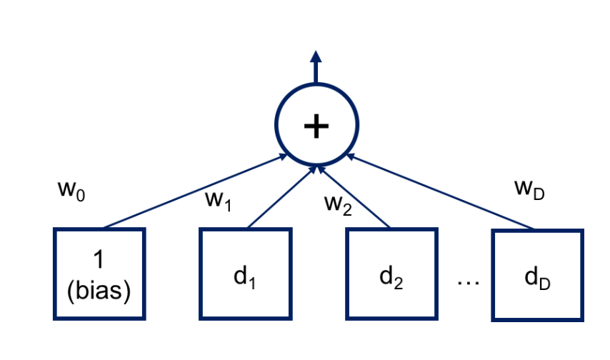
### Linear classification with the perceptron

Separate examples of two classes

For a dataset with numeric attributes

Learn a hyperplane such that all the positives lay on one side and all the negatives on the other

---

### The hyperplane

The hyperplane is described by a set of weights $w_0,...,w_D$ in a linear equation on the data attributes $x_0,...,x_D$

The fictitious attribute $x_0 = 1$ is added to allow a hyperplane that does not pass through the origin

There are either none or infinite such hyperplanes

>$$w_0 \cdot x_0 + w_1 \cdot x_1 + ... + w_D \cdot x_D \begin{cases} >0 & \Rightarrow \text{positive} \\ <0 & \Rightarrow \text{negative} \end{cases}$$

---

### Training the perceptron

**Learning the hyperplane**

**Algorithm 1: perceptron learning of a separating hyperplane**

**Data:** Training set $X = \{(x_i, y_i)\}$  
**Result:** Weight vector $w$ defining the hyperplane

---

### Linear perceptron convergence

Each change of weights moves the hyperplane towards the misclassified instance, consider the equation after the weight change for a positive instance $x_i$ which was classified as negative:

$$(w_0 + x_{i0}) \cdot x_{i0} + (w_1 + x_{i1}) \cdot x_{i1} + ... + (w_D + x_{iD}) \cdot x_{iD}$$

The result of the equation is increased by a positive amount:

$$x_{i0}^2 + ... + x_{iD}^2$$

Therefore the result will be less negative or, possibly, even positive

Analogously for a negative instance which was classified as positive

---

### Linear perceptron algorithm termination

The corrections are incremental and can interfere with previous updates

The algorithm converges if the dataset is linearly separable, otherwise it does not terminate

For practical applicability it is necessary to set an upper bound to the iterations


## Support vector machines (SVM) for binary classification

**Problems with high-dimensional data:**
- method becomes intractable for reasonable number of variables
- with 10 variables and maximum order 5: need ~2000 coefficients
- extremely prone to overfitting if number of parameters approaches number of examples

---

### Maximum margin hyperplane

**Linear perceptron limitation:**
- accepts any hyperplane that separates training classes
- some hyperplanes are better for classifying new items

**SVM advantage:**
- maximum margin hyperplane gives greatest separation between classes

---
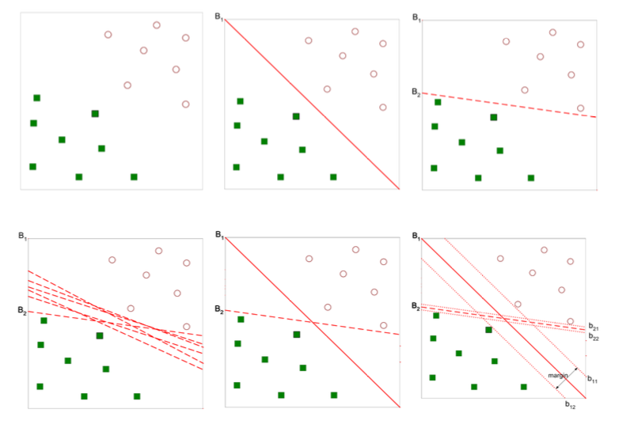
### Key ideas

**Computational learning theory:**
- efficient separability of non-linear functions using kernel functions
- optimization rather than greedy search

**Statistical learning:**
- prediction function search modeled as function estimation problem

**Convex hull properties:**
- tightest enclosing convex polygon for a set of points
- if dataset linearly separable: convex hulls of classes don't intersect
  
> Memo: *convex hull* it's the tightest possible convex boundary that encloses all points.

#### details
**Maximum margin hyperplane:**
- as far as possible from both hulls
- perpendicular bisector of shortest line connecting the hulls
- subset of points sufficient to define hull: **support vectors**

**Support vectors:**
- training set elements that would change the solution if removed
  


> **Mathematical formulation:**
Constrained quadratic optimization problem:
> $$\max_{w_0,w_1,...,w_D} M$$
> **Subject to:**
>$$\sum_{j=1}^{D} w_j^2 = 1$$
>$$c_i(w_0 + w_1x_{i1} + ... + w_Dx_{iD}) > M, \forall i = 1,...,N$$
>Where:
> - $c_i$ is the class of example $i$ (either -1 or 1)
> - $M$ is the margin
> - $N$ is the number of training examples
> - $D$ is the number of attributes
> - $w_0,...,w_D$ are the weights defining the hyperplane
> - $x_{i1},...,x_{iD}$ are the attribute values of example $i$

### Soft margin

**Problem:** Perfect separation is often impossible (the hyperplane may not exist)

**Solution:** Find a hyperplane that *almost* separates the classes

> Meaning: Allow some misclassification to get a better overall model

**Parameter C:**
> This parameter controls the trade-off between maximizing the margin and minimizing the classification error.
> It is just a regularization parameter.
- Small C = wider margin, more errors allowed
- Large C = narrower margin, fewer errors allowed
- **Critical to tune properly** to prevent overfitting

**Benefits:**
- More robust to noisy data
- Better performance on most training observations
- Handles non-separable datasets

### Non-linear class boundaries

**SVM advantage:** Avoids overfitting problems

**Solution for non-linearity:** Use non-linear mapping

**Process:**
- Map data to new **feature space**
- Linear boundary in feature space = non-linear boundary in original space
- Feature space can have higher dimensions than original space

**Result:** Complex decision boundaries become simple linear separators in transformed space
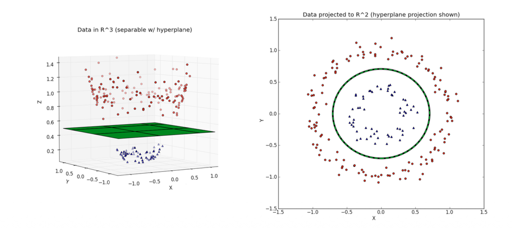

### The kernel trick

**Problem:** Computing in high-dimensional feature space can be complex

**Solution:** Use kernel functions to compute dot products in original space

**How it works:**
- Kernel functions compute similarity between vectors
- No need to explicitly map data to feature space
- All calculations done in original input space

**Common kernel functions:**
- **Linear:** $\langle x, x' \rangle$
- **Polynomial:** $(\gamma\langle x, x' \rangle + r)^{dg}$
- **RBF:** $\exp(-\gamma\|x - x'\|^2)$
- **Sigmoid:** $\tanh(\langle x, x' \rangle + r)$

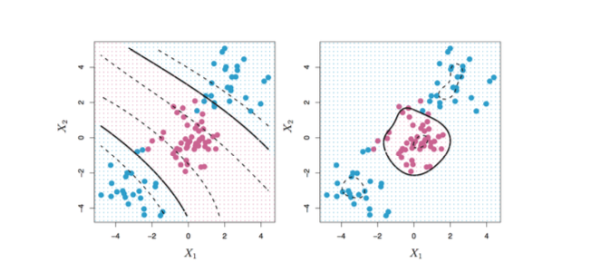
```python
from sklearn import svm

linear_svc = svm.SVC(kernel='linear')
rbf_svc = svm.SVC(kernel='rbf')
```
**Parameters:** $\gamma$, $dg$, $r$ are specific hyperparameters for kernels (on [scikit-learn docs](https://scikit-learn.org/stable/modules/svm.html#svm-kernels) you can find details about each kernel and its parameters)

**Rule of thumb:** Start with simpler kernels, then try more complex if needed
### SVM complexity

**Time complexity:** $O(D \cdot N^2)$ to $O(D \cdot N^3)$ (according to **libSVM**)
- Depends on optimization library efficiency
- Reduced for sparse data
### SVM conclusion

**Advantages:**
- Very accurate with complex decision boundaries
- Theoretical learning model foundation
- No local minima issues
- No curse of dimensionality (no distance notion)
- Provides confidence scores

**Disadvantages:**
- Slower learning than simpler methods (e.g., decision trees)
- Requires parameter tuning
- No direct probability estimates (requires expensive computation)
---

## Neural networks

A neural network is a computational model that arranges many perceptron-like elements into a hierarchical structure. This architecture is designed to overcome the limitation of linear decision boundaries found in simpler models. The design is inspired by the complex interconnections of biological neurons in animal brains.

### Biological inspiration and basic concepts

In biological systems:
*   A **neuron** functions as a signal processor with a specific activation threshold.
*   The **signal transmission** from one neuron to another is not uniform; it is weighted, meaning some connections are stronger than others.
*   These **weights are not static**; they can change over time, a process that is fundamental to learning.

---

## Multi-layer perceptron

The multi-layer perceptron (MLP) is a specific type of artificial neural network that formalizes these biological concepts into a mathematical framework.

*   The signals transmitted between artificial neurons are modeled as **real numbers**.
*   The threshold behavior of a biological neuron is modeled using a **mathematical activation function**.

### Activation function requirements

For the network to be effectively trained using gradient-based methods, the ideal activation function should be:
1.  **Continuous and differentiable.**
2.  **Bounded** (both superiorly and inferiorly).
3.  Ideally, its **derivative can be expressed in terms of the function itself**, which simplifies the underlying mathematics for learning.

examples of activation functions:
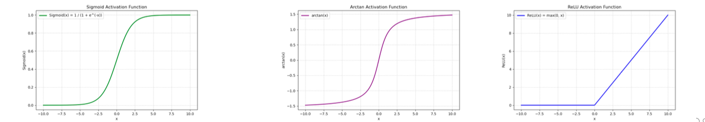
#### Sigmoid activation function

The sigmoid function, also known as a **squashing function**, maps any real-valued number into a fixed range, typically $0, 1)$.

*   It is **continuous, differentiable, and non-linear**.
*   Its formula is:
    > $$
    f(x) = \frac{1}{1 + e^{-x}}
    $$

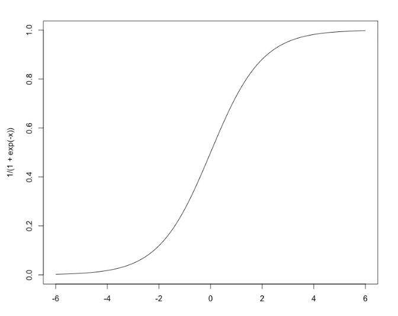
### The importance of non-linearity

The introduction of non-linearity is critical. Results from the simple linear perceptron were often unsatisfactory, not only due to linear inseparability problems but also because of how they handle input.

*   In a **linear system**, $f(x_1 + x_2) = f(x_1) + f(x_2)$. If $x_2$ represents noise, it is completely and directly transferred to the output, degrading performance.
*   In a **non-linear system**, this additive property generally does not hold $(f(x_1 + x_2) \neq f(x_1) + f(x_2))$, allowing the model to filter and process signals in a more complex and useful way.
*   Furthermore, the specific shape of the non-linear activation function can significantly influence the speed and stability of the learning process.

---

## Feed-forward multi-layered network architecture

A standard feed-forward neural network is organized into sequential layers:

1.  **Input layer:** This is the first layer, which receives the input features. There is typically **one input node for each dimension** in the training dataset.
2.  **Hidden layer(s):** The input layer feeds its outputs into one or more hidden layers. Each connection has an associated **weight**. The number of nodes in the hidden layer is a key **hyperparameter** that must be chosen by the model designer.
3.  **Output layer:** The final hidden layer feeds its outputs (again, via weighted connections) to the output layer. The number of nodes here is determined by the task:
    *   For **two-class classification**, a single output node is often sufficient.
    *   For **multi-class classification** with $k$ classes, it is common to have $k$ output nodes, one for each class.
    
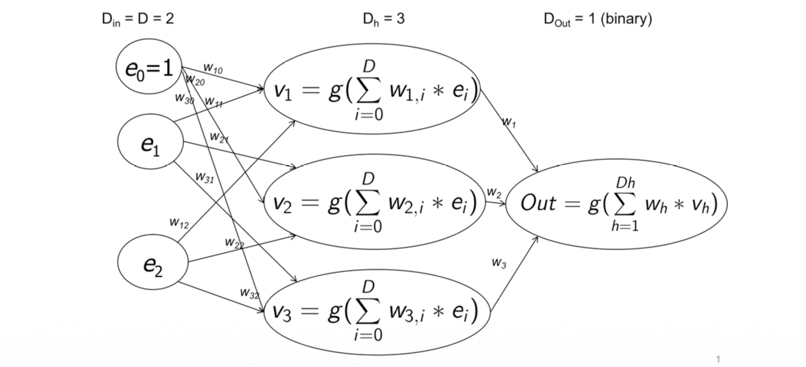
## Network architecture details
In a multi-layer perceptron, each node processes its inputs through a transfer function and produces an output. The mathematical representation is as follows:

- $g(\cdot)$ represents the **transfer function** of the node, which could be the sigmoid function or another activation function
- A **unitary input** $x_0$ is added to handle the bias term, similar to the linear perceptron model
- Each connection between nodes has an associated **weight** $w_{ij}$ for the edge connecting node $i$ to node $j$

### Feed-forward connectivity
The feed-forward structure defines the specific pattern of connections between nodes:
- **Layer-to-layer connections**: Edges only connect a node in one layer to a node in the immediately following layer
- **Specific connections**: 
  - Input layer nodes connect to hidden layer nodes
  - Hidden layer nodes connect to output layer nodes
- **Full connectivity**: Each node in a given layer is connected to **all nodes** in the subsequent layer

### Signal flow characteristics

This architecture creates a **unidirectional signal flow**:

- Information flows exclusively from the input layer toward the output layer
- There are **no feedback loops** or recurrent connections
- The network forms a **directed acyclic graph** where signals propagate forward without cycling back to previous layers

The output of a node $j$ in layer $l$ can be expressed as:
$$
y_j = g\left(\sum_{i=1}^{n} w_{ij}x_i + b_j\right)
$$
where $x_i$ are the inputs from the previous layer, $w_{ij}$ are the connection weights, $b_j$ is the bias term, and $g$ is the activation function.
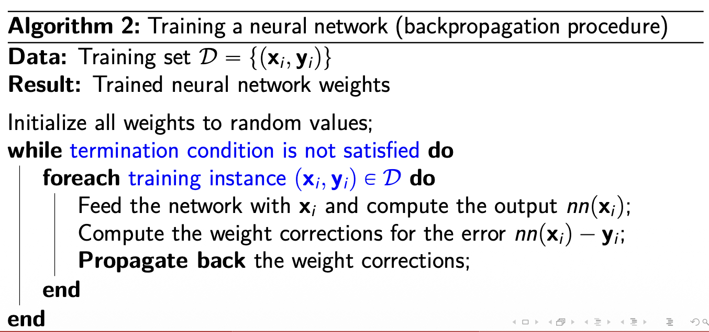

## Training the neural network

In analogy with learning in biological systems, training requires that examples are repeatedly presented to the network. The network's knowledge is encoded in the weight values, which are adjusted during training. However, this encoded knowledge appears as a structured set of real numbers that is not easily interpretable by humans.

### Important training considerations

Several critical factors must be addressed during neural network training:

- **Weight correction computation**: Determining how to adjust weights to reduce errors
- **Training data preparation**: 
  - Standardize attributes to have **zero mean and unit variance**
  - This normalization helps convergence and training stability
- **Termination conditions**: Defining when to stop training
- **Convergence uncertainty**: Convergence to an optimal solution is **not guaranteed**

---

## Computing weight corrections

### Error calculation

For a given node with input vector $x$ and desired output $y$, the error function is defined as:

> $$E(w) = \frac{1}{2}(y - \text{Transfer}(w,x))^2 $$
> where $w$ represents the input weight vector of the node and $\text{Transfer}(w,x)$ is the node's output given inputs $x$ and weights $w$.

### Error function landscapes

Error functions can have different characteristics:

- **Convex error functions**: Have a single global minimum, making optimization straightforward
- **Non-convex error functions**: Contain multiple local minima, making optimization more challenging and convergence to global optimum not guaranteed

## Computing the gradient

### Gradient descent approach

The training process moves toward a (local) minimum of the error function by following the negative gradient direction. This requires computing partial derivatives of the error with respect to each weight.
### Sigmoid derivative

For the sigmoid activation function:

$$
\text{sgm}(x) = \frac{1}{1 + e^{-x}}
$$

The derivative has a convenient form:

>$$\frac{d}{dx} \text{sgm}(x) = \frac{e^{-x}}{(1 + e^{-x})^2} = (1 - \text{sgm}(x)) \cdot \text{sgm}(x)$$

This property simplifies the mathematics of gradient computation.

### Weight update rule

Weights are updated using the gradient descent rule:

>$$w_{ij} \leftarrow w_{ij} - \lambda \frac{\partial E(w)}{\partial w_{ij}}$$
>where:
>- $\lambda$ is the **learning rate** constant
>- The learning rate represents a tradeoff between convergence speed and precision
>- The subtraction moves weights in the direction that reduces error

### Backpropagation principle

The derivatives for weights in earlier layers can be computed efficiently using the **chain rule** if the derivatives for subsequent layers are known. This forms the basis of the backpropagation algorithm.

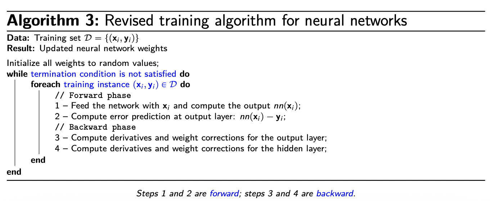

### Local minima
As with most gradient-based optimization methods, neural networks can converge to **local minima** rather than the global optimum. This occurs when the error landscape is non-convex with multiple valleys.

### Overfitting
Overfitting is a significant risk, particularly when the network architecture is **too complex** relative to the underlying decision problem. An over-parameterized network may memorize training data rather than learning generalizable patterns.

## Regularization

Regularization is a technique used across machine learning to improve model generalization by modifying the performance function. The standard approach uses the sum of squared errors on the training set, but regularization adds a correction term to smooth the fitting to data.

**Key principle**: 
- Improve performance by reducing a loss function (typically sum of squared errors)
- Regularization corrects the loss function to prevent overfitting
- The **amount of regularization must be carefully tuned** to balance bias and variance

## Choosing activation functions: guidelines

### ReLU (Rectified Linear Unit)
- **Default choice** for most deep networks
- **Fast convergence** due to linear, non-saturating behavior
- **Risk**: "Dying ReLU" problem where neurons become permanently inactive
- **Alternatives**: LeakyReLU or ELU if neuron death occurs
### Sigmoid
- Maps input to $(0, 1)$ range, suitable for probability outputs
- **Vanishing gradient** problem for large $|x|$ values
- **Use case**: Primarily in output layer for binary classification
### Tanh (Hyperbolic Tangent)
- Zero-centered output in $(-1, 1)$ range
- Generally **preferable to sigmoid** for hidden layers in shallow networks
- Still suffers from **vanishing gradients** in deep architectures
### Softmax
- Used exclusively in the **output layer for multi-class classification**
- Converts raw scores into **normalized probability distributions**

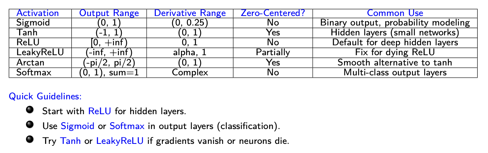

## Choosing output activations by task

### Regression tasks
- **Goal**: Predict continuous values (e.g., temperature, price)
- **Output activation**: Linear (none)
- **Example**: $\hat{y} = Wx + b$
### Binary classification
- **Goal**: Output probability of positive class
- **Output activation**: Sigmoid
- **Example**: $\hat{y} = \sigma(Wx + b)$, where $\sigma(x) = \frac{1}{1 + e^{-x}}$
### Multi-class classification
- **Goal**: Probability distribution over multiple classes
- **Output activation**: Softmax
- **Example**: $\hat{y}_i = \frac{e^{z_i}}{\sum_j e^{z_j}}$
### Multi-label classification
- **Goal**: Independent binary predictions for multiple labels
- **Output activation**: Sigmoid (per output node)
- **Loss**: Binary cross-entropy per output unit

**Summary**: Use ReLU (or variants) for hidden layers, and choose output activation based on task: linear for regression, sigmoid for binary classification, softmax for multi-class classification.


> ***Universal approximation theorem***
> **Core principle**
> A feedforward neural network with:
> - At least one hidden layer
> - Non-linear activation function
>
> **Can approximate any continuous function on a bounded domain**.
> So we can look at NN as general-purpose function approximators


### Example: approximating $\sin(x)$

The network learns $\sin(x)$ by observing input-output pairs without any trigonometric knowledge, demonstrating pattern learning from data.

```python
import numpy as np
import tensorflow as tf
from tensorflow import keras
import math
import matplotlib.pyplot as plt

# Generate training data for sin(x)
xs = np.linspace(-math.pi, math.pi, 200).reshape(-1, 1)
ys = np.sin(xs)

# Define the neural network model
model = keras.Sequential([
    keras.layers.Dense(16, activation='tanh', input_shape=(1,)),  # Hidden layer with 16 neurons
    keras.layers.Dense(1)  # Output layer for regression
])

# Compile the model with Adam optimizer and mean squared error loss
model.compile(optimizer=keras.optimizers.Adam(0.01), loss='mse')

# Train the model
history = model.fit(xs, ys, epochs=2000, verbose=0)

# Generate predictions
ys_pred = model.predict(xs)

# Plot sin(x) vs neural network approximation
plt.figure()
plt.plot(xs, ys, label='True sin(x)')
plt.plot(xs, ys_pred, label='Neural network approximation')
plt.legend()
plt.savefig("sin_approx.png")

# Plot training loss over epochs
plt.figure()
plt.plot(history.history['loss'])
plt.xlabel("Epoch")
plt.ylabel("Loss")
plt.savefig("../fig/sin_loss.png")
```

>In particular this snippet is the one responsible to create the hidden layer with 16 neurons with tanh activation function and the output one with only one neuron with no activatio function (it gives real value of output.) 
```python
	model = keras.Sequential([
	    keras.layers.Dense(16, activation='tanh', input_shape=(1,)),
	    keras.layers.Dense(1)
	])
```

#### Computational flow
1. **First layer**: $z_1 = xW_1 + b_1$ where $W_1$ has shape $(1,16)$ and $b_1$ has shape $(16)$  
   $h = \tanh(z_1)$
2. **Output layer**: $\hat{y} = hW_2 + b_2$ with $W_2$ of shape $(16,1)$ and $b_2$ scalar

**Total parameters**: $(1 \cdot 16 + 16) + (16 \cdot 1 + 1) = 49$

The hidden layer with $\tanh$ activation enables the network to construct non-linear mappings and approximate complex functions like $\sin(x)$.

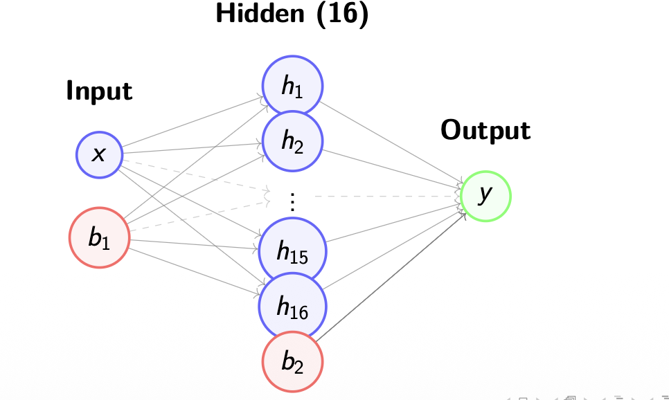

## KNN Classifier (K Nearest Neighbours)

The K-nearest neighbors (KNN) algorithm operates by retaining the entire training dataset as the model. When making predictions for new data points, the algorithm computes the similarity between the new sample and every instance in the training set.

### Prediction process
1. **Similarity computation**: Calculate the similarity between the new data point and each training instance using any appropriate similarity function
2. **Neighbor selection**: Identify the $K$ entries in the training database that are closest to the new data point
3. **Decision making**: Apply majority voting (for classification) or averaging (for regression) among the selected neighbors

### Key parameters
- **Number of neighbors ($K$)**: The number of closest training examples to consider for prediction
- **Distance metric**: The function used to compute similarities between data points
- **Mahalanobis distance**: Often provides good performance as it accounts for correlations in the data and is scale-invariant (look at the pdf proximity-measures)

The algorithm's simplicity comes from storing all training data, with computational complexity primarily in the similarity calculations during prediction rather than during training.

---
## Loss functions

## Definition of loss
>A loss function (or cost function) measures how well a model's predictions match the actual target values. Formally, for a single example:
> $$L(y, \hat{y})$$
> where:
> - $y$ is the true value (ground truth)
> - $\hat{y}$ is the predicted value from the model
> - $L$ quantifies the discrepancy between prediction and reality

### Key concepts
- **Purpose**: Provides a numerical score indicating prediction error - lower loss means better predictions
- **Model learning**: The model learns by minimizing this loss during training
- **Total loss**: For a dataset with $n$ examples: 
  > $$L = \frac{1}{n}\sum_{i=1}^{n} L(y_i, \hat{y}_i)$$

### Common loss functions
**Regression** (continuous outputs):
- **Mean Squared Error (MSE)**: $L(y, \hat{y}) = (y - \hat{y})^2$
- **Mean Absolute Error (MAE)**: $L(y, \hat{y}) = |y - \hat{y}|$

**Classification** (discrete outputs):
> - **Cross-Entropy Loss**: $L(y, \hat{y}) = -\sum_c y_c \log(\hat{y}_c)$
- **Hinge Loss**: Used in SVMs

### Training process
>The learning algorithm finds parameters $\theta$ that minimize the loss:
>$$\theta^* = \arg \min_\theta L(\theta)$$

This is typically done through gradient descent:
- Compute $\nabla_\theta L$ (gradient of loss with respect to parameters)
- Iteratively update: $\theta \leftarrow \theta - \alpha \nabla_\theta L$

### Loss function vs. metric
- **Loss function**: Used during training to guide optimization; must be differentiable
- **Metric** (like accuracy): Used to measure performance; doesn't need to be differentiable

**Why accuracy isn't used as loss**:
- Non-differentiable (step function)
- Small parameter changes often don't change accuracy
- Gradient-based optimizers cannot use it

### Cross-entropy loss
**Intuitive idea**: Measures how "surprised" the model is by the true labels:
- If model assigns high probability to correct class → low surprise → low cross-entropy
- If model assigns low probability to correct class → high surprise → high cross-entropy

**Formula**: For one sample with true class $y$ and predicted probability $q_y$:
$$H(p,q) = -\log(q_y)$$

**Example**: Cat vs. dog classifier
- True label: "cat", Model: $P(\text{cat}) = 0.9$ → Cross-entropy $= -\log(0.9) = 0.105$
- True label: "cat", Model: $P(\text{cat}) = 0.1$ → Cross-entropy $= -\log(0.1) = 2.302$

## Multi-class classification strategies

### Approaches for binary classifiers
Some classifiers (e.g., SVM, linear perceptron) are inherently binary. Two main strategies extend them to multi-class:

1. **Transform the training algorithm and model** (sometimes increases problem size)
2. **Use multiple binary classifiers and combine results** (increases number of problems to solve)

### One-vs-one (OVO) strategy
- Consider all possible pairs of classes
- Generate binary classifier for each pair: $C \times (C-1)/2$ pairs
- Each binary problem uses only examples from the two selected classes
- **Prediction**: Apply voting scheme - class with most votes wins

### One-vs-rest (OVR) strategy
- Consider $C$ binary problems where class $c$ is positive and all others are negative
- Build $C$ binary classifiers
- **Prediction**: Each classifier provides confidence score - class with highest score wins

### OVO vs. OVR comparison
- **OVO**: Higher number of problems, but each is smaller
- **OVR**: Fewer problems, but intrinsically unbalanced (positive:negative ratio = 1:$(C-1)$)
---
## Ensemble methods

Also known as classifier combination, ensemble methods involve training a set of base classifiers where the final prediction is obtained by aggregating the votes of the individual base classifiers. Ensemble methods consistently demonstrate better performance than single classifiers across various machine learning tasks.

### Rationale for ensemble methods

Ensemble methods are effective when two key conditions are met:

1. The base classifiers are **independent** (make uncorrelated errors)
2. The performance of each base classifier is **better than random choice**

### Methods for creating ensemble classifiers

#### By manipulating the training set

**Bagging** (Bootstrap Aggregating):
- Repeatedly samples training data with replacement using uniform probability distribution
- Creates multiple diverse training subsets

**Boosting**:
- Iteratively changes the distribution of training examples
- Forces base classifiers to focus on examples that are hard to classify
- **AdaBoost**: Each base classifier's importance depends on its error rate

#### By manipulating the input features

- Subsets of input features are chosen randomly or using domain expertise
- **Random Forest**: Uses decision trees as base classifiers with random feature subsets
- Frequently produces excellent results in practice

#### By manipulating the class labels

Particularly useful when dealing with high numbers of classes:

- For each base classifier, randomly partition class labels into two subsets $A_1, A_2$
- Re-label the dataset according to these partitions  
- Train binary classifiers on the relabeled data
- During testing, when a subset is selected, all classes within it receive a vote
- The class with the highest cumulative score wins the final prediction

## Forest of randomised trees

Random forests use perturb-and-combine techniques specifically designed for decision trees. A diverse set of classifiers is created by introducing randomness during the classifier construction process, with the key requirement that the classifiers must be independent.

### Construction process
- Each tree in the ensemble is built from a **bootstrap sample** (sample drawn with replacement) from the training set
- When splitting nodes during tree construction, the best split is found from either:
  - All input features, or
  - A random subset of features of size `max_features`
- The ensemble prediction is obtained by combining individual classifier predictions through voting or averaging

### Bias-variance tradeoff

**Bias**: The simplifying assumptions made by the model to make the target function easier to approximate  
**Variance**: The amount that the estimate of the target function changes given different training data  
**Bias-variance tradeoff**: The optimal balance between errors introduced by bias and variance

*Analogy*: Bias vs variance is like skimming a text (high bias, low variance) versus memorizing a text (low bias, high variance)

### Random forest benefits

The two sources of randomness (bootstrap sampling and random feature subsets) serve to decrease the variance of the forest estimator:

- Individual decision trees typically exhibit high variance and tend to overfit
- Injected randomness creates decision trees with decoupled prediction errors
- By averaging predictions, some errors cancel out
- Random forests achieve reduced variance by combining diverse trees, sometimes with a slight increase in bias
- In practice, the variance reduction is often significant, yielding an overall better model

## Ensemble learning with boosting

Boosting associates a weight with each training instance and trains different classifiers using those weights. The weights are modified iteratively according to classifier performance.

### AdaBoost algorithm

AdaBoost fits a sequence of weak learners on repeatedly modified versions of the data, with predictions combined through a weighted majority vote.

**Initialization**: All weights $w_1, w_2, ..., w_N$ are set to $1/N$, so the first weak learner trains on the original data

**Iterative process**:
- Sample weights are individually modified for each successive iteration
- The learning algorithm is reapplied to the reweighted data
- Training examples that were incorrectly predicted in the previous step have their weights increased
- Correctly predicted examples have their weights decreased

As iterations proceed, difficult-to-predict examples receive ever-increasing influence, forcing each subsequent weak learner to concentrate on examples missed by previous ones.

### Other boosting algorithms

- **XGBoost (Extreme Gradient Boosting)**: Popular implementation designed for speed and performance
- **LightGBM**: Microsoft's gradient boosting framework for efficient training on large datasets
- **CatBoost**: Yandex's library that handles categorical features efficiently
- **Gradient Boosting Machines**: General class of algorithms that build models stage-wise
- **H2O.ai**: Open-source software for distributed gradient boosting
- **TensorFlow Decision Forests**: Google's implementation of decision forests
- **Sklearn Gradient Boosting**: Generalization of boosting to arbitrary differentiable loss functions

---

## XGBoost (eXtreme Gradient Boosting)

### Core concept

XGBoost is an ensemble learning method that combines many weak learners (decision trees) to create a strong predictor. Think of it as a committee of experts where each expert is relatively simple, each new expert focuses on correcting previous mistakes, and their combined opinion is highly accurate.

### Sequential learning process

XGBoost builds trees sequentially rather than independently:

1. Start with a simple prediction (e.g., mean of training labels)
2. Build a tree to predict the errors (residuals) of the current model
3. Add this tree to the model with a small weight
4. Repeat: each new tree focuses on what previous trees got wrong

The final prediction is the sum of all tree predictions:
>$$\hat{y} = \sum_{t=1}^{T} f_t(x)$$
> where $f_t$ is the $t$-th tree and $T$ is the total number of trees.

### Gradient boosting mechanism

The algorithm uses gradient descent in function space:
- Define a loss function $L(y, \hat{y})$ measuring prediction error
- Each new tree approximates the negative gradient of the loss
- This is equivalent to taking small steps toward minimizing error
- Mathematically: fit tree to $-\frac{\partial L}{\partial \hat{y}}$

### Classification with XGBoost

**Binary classification**:
1. Trees output real-valued scores, not probabilities
2. Final score: $F(x) = \sum_{t=1}^{T} f_t(x)$
3. Convert to probability using sigmoid: $P(y=1|x) = \frac{1}{1+e^{-F(x)}}$
4. Predict class 1 if $P(y=1|x) > 0.5$

**Multi-class classification**:
- Build one set of trees per class
- Use softmax to convert scores to probabilities
- Predict the class with highest probability

### XGBoost enhancements

Beyond standard gradient boosting, XGBoost adds:

**Regularization**:
- Penalizes complex trees to prevent overfitting
- Controls tree depth, number of leaves, and leaf weights

**Smart tree building**:
- Uses second-order gradients (Newton's method) for better optimization
- Approximate split finding for faster training on large datasets

**Systems optimization**:
- Parallel processing for building trees
- Cache-aware computation
- Automatic handling of missing values

### Key hyperparameters

- **Number of trees ($T$)**: More trees = more complex model; too many causes overfitting
- **Learning rate ($\eta$)**: Shrinks each tree's contribution; smaller values require more trees but generalize better
- **Tree depth**: Controls complexity of individual trees; deeper trees capture more interactions
- **Regularization parameters**: Control penalty on tree complexity

### Practical advantages

XGBoost frequently dominates on structured/tabular data because it:

- Is highly accurate on medium-sized datasets
- Handles non-linear relationships and interactions well
- Is robust to outliers and irrelevant features
- Has fast training compared to other ensemble methods
- Works well out-of-the-box with minimal tuning

**Use when**: Working with tabular data with mixed feature types, needing high accuracy with reasonable training time, or when deep learning would be overkill.

### Practical tips

>**Training strategy**:
>1. Start with default parameters
>2. Use cross-validation to tune hyperparameters
>3. Common tuning sequence: number of trees → learning rate → tree depth → regularization
>4. Monitor validation loss to detect overfitting
>
>**Watch for**:
>- Overfitting with too many deep trees
>- Class imbalance (use `scale_pos_weight` parameter)
>- Memory usage on very large datasets
>

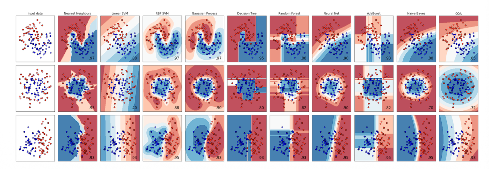
