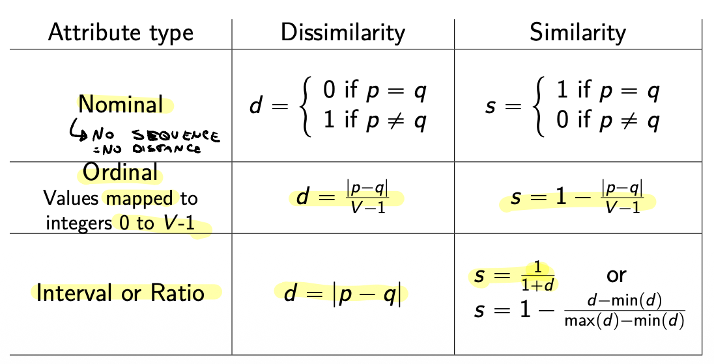
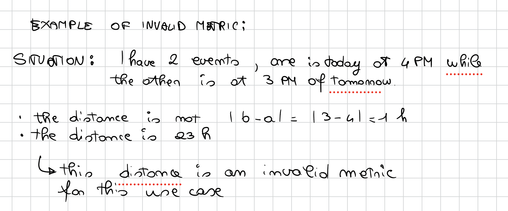
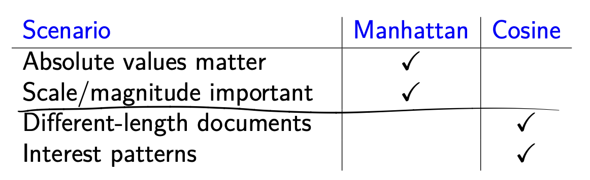

 # Proximity measures

Proximity measures are numerical measures of how alike, different or distant two data objects are.
This is fundamental in many applications for ML, in particular clustering.

### Similarity

Numerical measure of how alike two data objects are.
- is higher when objects are more alike.
- often falls in the range [0,1]

### Dissimilarity
Numerical measure of how different are two data objects.
- lower when objects are more alike
- minimum dissimilarity is often 0
- upper limit varies

### Proximity

Refers to a similarity or dissimilarity.
- almost same as distance

##### Common definitions by attribute type:

### Euclidean distance – L2

$$dist = \sqrt{\sum_{d=1}^{D} (p_d - q_d)^2}$$

Where $D$ is the number of dimensions (attributes) and $p_d$ and $q_d$ are, respectively, the $d$-th attributes (components) of data objects $p$ and $q$

**Important:** Standardization/rescaling is necessary if scales differ

### Minkowski distance – Lr

$$dist = \left( \sum_{d=1}^{D} |p_d - q_d|^r \right)^{\frac{1}{r}}$$

Where $D$ is the number of dimensions (attributes) and $p_d$ and $q_d$ are, respectively, the $d$-th attributes (components) of data objects $p$ and $q$

**Important:** Standardization/rescaling is necessary if scales differ

> $r$ is a parameter which is chosen depending on the data set and the application

Common choices for r:

**$r = 1$**: also named city block, Manhattan, $L_1$ norm
- it is the best way to discriminate between zero distance and near zero distance
- a 1 change on any coordinate causes a 1 change in the distance (unlike Euclidean where the effect is diluted by the square root of the sum of squares)
- works better than Euclidean in very high dimensional spaces

**$r = 2$**: Euclidean, $L_2$ norm

**$r = \infty$**: also named Chebyshev, supremum, $L_{max}$ norm, $L_\infty$ norm
- considers only the dimension where the difference is maximum
- provides a simplified evaluation, disregarding the dimensions with lower differences

$$dist_\infty = \lim_{r \to \infty} \left( \sum_{d=1}^{D} |p_d - q_d|^r \right)^{\frac{1}{r}} = \max_d |p_d - q_d|$$

### Mahalanobis distance

> Considers **data distribution**

The Mahalanobis distance between two points $p$ and $q$ decreases if, *keeping the same Euclidean distance*, the segment connecting the points is stretched along a direction of greater variation of data.

The distribution is described by the covariance matrix of the data set

$$dist_m = \sqrt{(p - q)\Sigma^{-1}(p - q)^T}$$

$$\Sigma_{ij} = \frac{1}{N-1} \sum_{k=1}^{N} (x_{ki} - \bar{x}_i)(x_{kj} - \bar{x}_j)$$

---

### Mahalanobis distance – example

$\Sigma = \begin{bmatrix} 0.3 & 0.2 \\ 0.2 & 0.3 \end{bmatrix}$

$A = (0.5, 0.5)$  
$B = (0, 1)$  
$C = (1, 1)$

The Euclidean distances AB and AC are the same

$dist_m(A, B) = 2.236068$  
$dist_m(A, C) = 1$

---

### Covariance matrix

Variation of pairs of random variables

- the summation is over all the observations
- the main diagonal contains the variances
- the values are positive if the two variables grow together
- if the matrix is diagonal the variables are non-correlated
- if the variables are standardised the diagonal contains "one"
- if the variables are standardised and non correlated, the matrix is the identity and the Mahalanobis distance is the same as the Euclidean

---

### Common properties of a distance

1. **Positive definiteness:** $Dist(p, q) \\\\geq 0$ $\\\\forall p, q$ and $Dist(p, q) = 0$ if and only if $p = q$
2. **Symmetry:** $Dist(p, q) = Dist(q, p)$
3. **Triangle inequality:** $Dist(p, q) \leq Dist(p, r) + Dist(r, q)$  $,\forall p, q, r$

A distance function satisfying all the properties above is called a **metric**

### Recommendation system example: movie ratings

**Why Manhattan works better:**
- sparse matrix: users rate only a few movies
- better handling of missing values
- more robust to extreme ratings

---

### Distance calculation example

**Comparing user A and user D (common movies: Inception, Matrix):**

Manhattan distance:
$|5 - 5| + |4 - 3| = 0 + 1 = 1$

Euclidean distance:
$\\sqrt{(5-5)^2 + (4-3)^2} = \\\\sqrt{0 + 1} = 1$

**For vectors [5,1,5,1] and [4,2,4,2]:**
Manhattan: $|5-4| + |1-2| + |5-4| + |1-2| = 4$
Euclidean: $\\sqrt{1^2 + 1^2 + 1^2 + 1^2} = 2$

Manhattan better captures total distance between preferences

---

### Practical application: collaborative filtering

**Algorithm:**
1. Calculate Manhattan distance from user A to all other users
2. Identify the k nearest neighbors (e.g., k=3)
3. Recommend to A the movies appreciated by neighbors that A hasn't seen yet

**Example:**
If user D is most similar to user A
Recommend "Avengers" to A (D rated it 4 stars)

This approach works particularly well with Manhattan distance for sparse datasets

---

### Supremum (Chebyshev) distance use cases

- **Anomaly detection:** efficient for detecting extreme deviations across high-dimensional features
- **Chessboard distance:** used in modeling real-world systems where maximum single-step moves matter
- **Industrial applications:** applied in quality control, where maximum tolerances are checked

---

### Cosine similarity use cases
- **Text mining and document similarity:** used for document comparison and recommendation systems
- **Image similarity:** applied in image retrieval systems to match images with similar features
- **Recommendation systems:** collaborative filtering methods leverage cosine similarity

---

### Manhattan vs cosine distance: key differences

| Manhattan distance | Cosine similarity |
|-------------------|-------------------|
| Measures absolute differences | Measures angle/direction |
| Sensitive to magnitude | Magnitude-invariant |
| Formula: $\sum_{i=1}^n x_i - y_i$	|Formula: $\frac{x \cdot y}{\|x\|\|y\|}$|
| Range: $[0, \infty)$ | Range: $[-1, 1] $ |

---

### Example 1: movie ratings (when magnitude matters)

Three users rate movies on scale 1-5:

| User | Movie 1 | Movie 2 | Movie 3 | Profile |
|------|---------|---------|---------|---------|
| Alice | 5 | 5 | 5 | Loves everything |
| Bob | 3 | 3 | 3 | Moderate ratings |
| Carol | 5 | 5 | 4 | Loves most things |

**Manhattan distance:**
- Alice-Bob: $|5-3| + |5-3| + |5-3| = 6$
- Alice-Carol: $|5-5| + |5-5| + |5-4| = 1$
- Bob-Carol: $|3-5| + |3-5| + |3-4| = 5$

**Result:** Alice is closest to Carol (both are enthusiastic raters)

**Cosine similarity perspective:**
All users are highly similar! Cosine ignores that Bob rates lower overall.

**Use Manhattan when rating scale/magnitude matters**

---

### Example 2: document similarity (when direction matters)

Three documents represented by word frequencies:

| Document | "machine" | "learning" | "algorithm" | "data" |
|----------|-----------|------------|-------------|--------|
| Doc A | 10 | 8 | 12 | 15 |
| Doc B | 2 | 1 | 3 | 2 |
| Doc C | 5 | 12 | 3 | 8 |

**Manhattan distance:**
- A-B: $|10-2| + |8-1| + |12-3| + |15-2| = 37$
- A-C: $|10-5| + |8-12| + |12-3| + |15-8| = 25$

**Cosine similarity:**
- A-B: 0.959
- A-C: 0.785

**Result:** Cosine correctly identifies Doc B as more similar to A (same topic despite length difference)

**Use Cosine when you care about proportional similarity, not absolute counts**

---

### Example 3: user behavior vectors

Two users' activity on a website (clicks per section):

| User | News | Sports | Tech | Entertainment |
|------|------|--------|------|---------------|
| User X | 100 | 80 | 60 | 40 |
| User Y | 10 | 8 | 6 | 4 |

**Manhattan distance:** 270 (very large - treats them as different)
**Cosine similarity:** 1.0 (perfect - same interest distribution!)

**Decision:**
- use Manhattan if engagement level matters
- use Cosine if interest pattern matters

---

### Quick decision guide

**Rule of thumb:**
- Manhattan: "How different are the values?"
- Cosine: "How similar are the patterns?"

---

### Jaccard similarity

**Definition:** measures overlap between two sets relative to their union

**Use cases:**
- document similarity in information retrieval
- image processing
- clustering and community detection