#### TIPS
- w.r.t means "with respect to"

# Data
## Data types

Data can be categorized along several dimensions:

- **Quantitative**: Numerical data (continuous or discrete)
- **Qualitative**: Categorical data (nominal or ordinal)
- **Structured**: Organized in predefined formats (tables, databases)
- **Unstructured**: No predefined organization (text, images, audio)

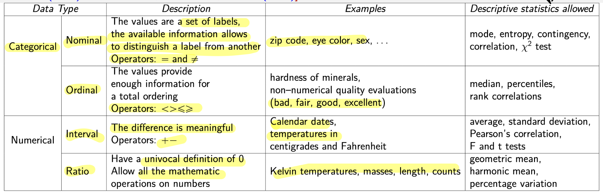

"description" and "descriptive statistics" sums while descending (Ordinal has everything in Nominal, plus its own and so on).

**Discrete domains**
- allow a finite number of values (or infinitely countable)
- codes, counts, ...
- special case: binary attributes
- special case: identifier

**Continuous domains**
- floating point variables
- nominals and ordinals are discrete, possibly binary
- intervals and ratio are continuous
- counts are discrete and ratio

## Data quality 
***"Data are never perfect"***
###  Main problems
- **Missing values**: Incomplete data records (lot of nulls)
- **Inconsistent data**: Contradictory information across sources
- **Duplicated entries**: Redundant data instances
- **Wrong values**: Incorrect or inaccurate data
- **Outliers**: Small amounts of data that significantly differ from the rest (can be due to error during measurement, data entry errors, or genuine variability)

### Outliers
- Represent anomalies or errors in the dataset
- Some machine learning techniques are more **robust with respect to errors** than others
- Detection and handling crucial for model performance

**Key point**:  $\text{Better data quality} \Rightarrow \text{Better results}$

**Critical principle**: $Garbage-in–Garbage-out$
- Poor quality input data inevitably leads to poor model performance
- **No algorithm can compensate for fundamentally flawed data**

--- 
## More on data types

### Interval data vs ratio data
Interval **does not preserve relative value upon scale change**

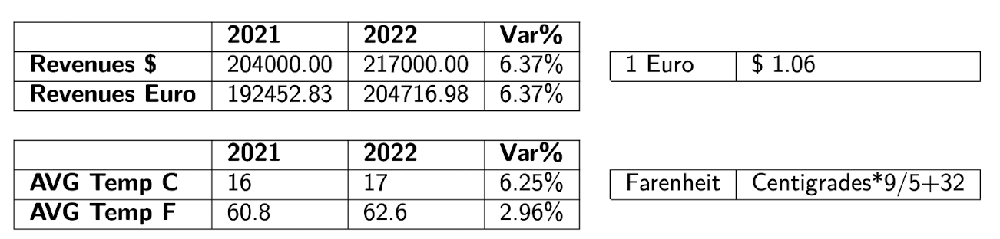

### Data transformations
Not all transformations are allowed according to the data type
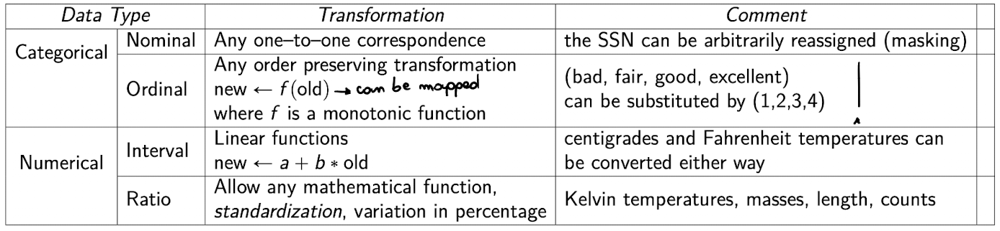


## Asymmetric attributes
- ***We only care if it is not null (only interested if the value is present)***

## **General characteristics of data sets**

### **Dimensionality**
*   The difference between having a small or a large (hundreds, thousands, ...) number  of attribute is also qualitative
### **Sparsity**
*   Sparsity means that there are many zeros or nulls
*   Some databases stores the nulls as zeros or placeholders value (still irrelevant and noisy)

### **Resolution**
*   Greatly influences the results
*   The analysis of too detailed data can be affected by noise
*   The analysis of too general data can hide interesting patterns

### **Record data**

- **Tables**
	*  e.g. relational databases (also dataframes)
- **Transaction**
	*  a row is composed by: TID + set of Items
	* e.g: { id: 1, bought: [hairdryer, facemask...]}
- **Data matrix**
	*  numeric values of the same type
	*  a row is a point in a vector space
- **Sparse data matrix**
	*  asymmetric values of the same type
- Graph data
	- e.g: all XML-like files like html pages

## Noise
- Original data are **modified** or there is a **mix of interesting and uninteresting** data

## Outliers
**Outlier** = data whose characteristics are considerably different from most of the data in the dataset. 

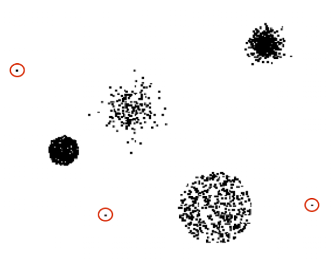

#### **IQR - InterQuartile Range**

$Q1$: first quartile, $Q3$: third quartile,

$IQR = Q3 - Q1$
$Lower$  $boundary$ $= Q1 - IQR \times 1.5$
$Upper$ $boundary$ $= Q3 + IQR \times 1.5$

*Consider outlier the values out of the whiskers*
The upper whisker will extend to last datum less than $Q3 + 1.5 \times IQR$

---
#  Classification
**Unsupervised Classification**

- The unsupervised mining techniques which can be in some way related to classification are usually known in literature with names different from classification

- **Classification** = supervised classification

## Soybean example

**The Data Set**

- The data set $X$ contains $N$ individuals described by $D$ attribute values each
- We have $Y$ vector which, for each individual $x$ contains the class value $y(x)$ (labels)
- The class allows a finite set of different values (e.g. the diseases), say $C$
- The class values are provided by experts: the supervisors
- We want to learn how to guess the value of the $y(x)$ for individuals which have not been examined by the experts

## Definition of classification model

- **An algorithm which, given an individual for which the class is not known, computes the class**
- The algorithm is parametrized to optimize results for the specific problem

**Development Process:**
1. Choose the learning algorithm
2. Let the algorithm learn its parametrization
3. Assess the quality of the classification model

**Usage:**
- The classification model is used by a run-time classification algorithm with the developed parametrization

### Formal definition

**Decision function:**
$$M(x, \theta) = y(x)_{pred}$$
**Where:**
- $x$: data element with unknown class label $y(x)$
- $\theta$: set of parameter values for the decision function
- $y(x)_{pred}$: predicted class

**Learning Process:**
Given classifier $M(.,.)$, dataset $X$, and supervised labels $Y$, determine $\theta$ to **minimize** prediction error.

##### Example
For simple domain we can use a straight line as decison function.
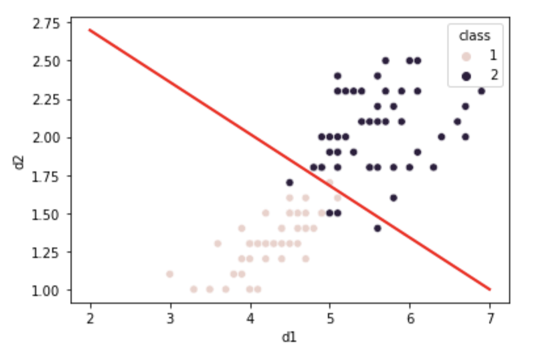
We can see that it makes mistakes.
It's normal, every classifier makes mistakes (even with the best fit for parameters)

## **Vapnik-Chervonenkis Dimension**

*Given a dataset with $N$ elements there are $2^N$ possible different learning problems.*
If a model $M(.,.)$ is able to shatter **all** the possible learning problems with $N$ elements, we say that it has **Vapnik-Chervonenkis** Dimension equal to $N$.

**The straight line has VC dimension 3.**

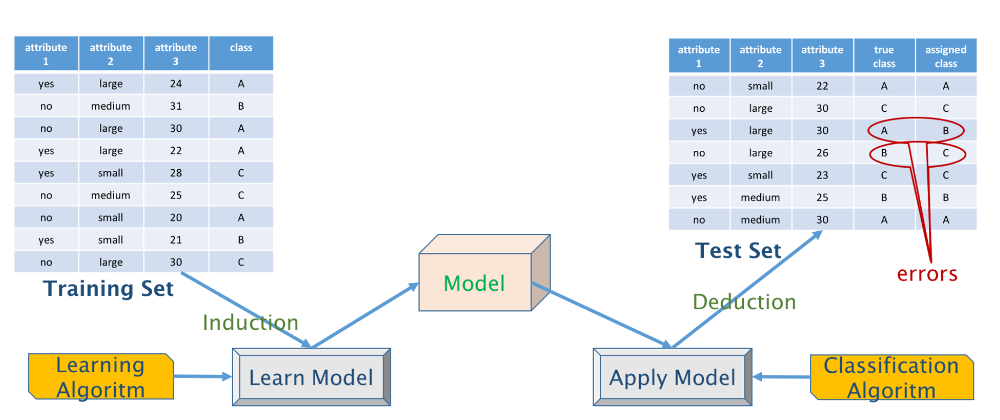
*example of a classification workflow*

### Different types of classificators
- CRISP
	- the classifier assigns to each individual one label
- Probabilistic
	- the classifier assigns a probability for each of the possible labels


## Decision Trees
##### Main strength
Good compromise: decent performance, fast to train and execute, easy to understand

### **Decision Tree Structure**
A run-time classifier structured as a decision tree is a **tree-shaped set of tests**.
The decision tree has:
- **Inner** nodes
- **Leaf** nodes

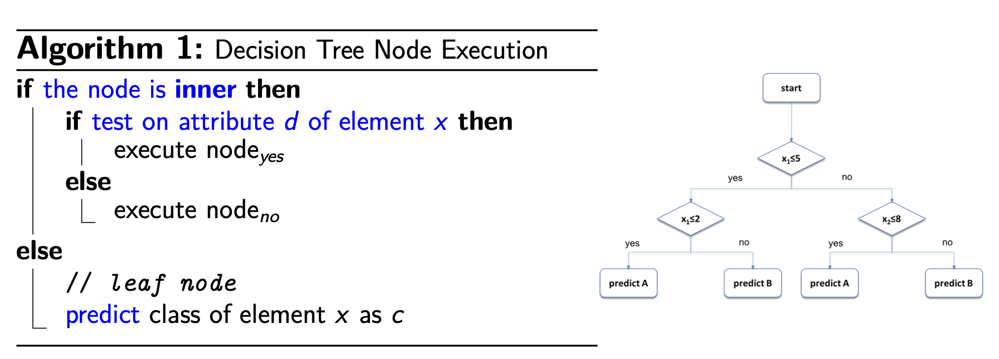

### Learning a decision tree – Model generation

Given a **set $X$ of elements** for which the class is known, grow a decision tree as follows:

- If all the elements belong to class $c$ or $X$ is small: generate a leaf node with label $c$

- Otherwise:
  1. Choose a test based on a single attribute with two or more outcomes
  2. Make this test the root of a tree with one branch for each of the outcomes of the test
  3. Partition $X$ into subsets corresponding to the outcomes
  4. Apply recursively the procedure to the subsets

**The main question is: what feature are more significant and should be used first in the decision process?**

#### We explore the data to find out.
##### Boxplots 
- Good for outliers

```python
plt.figure(figsize=(15,10))

sns.boxplot(data = df);


```
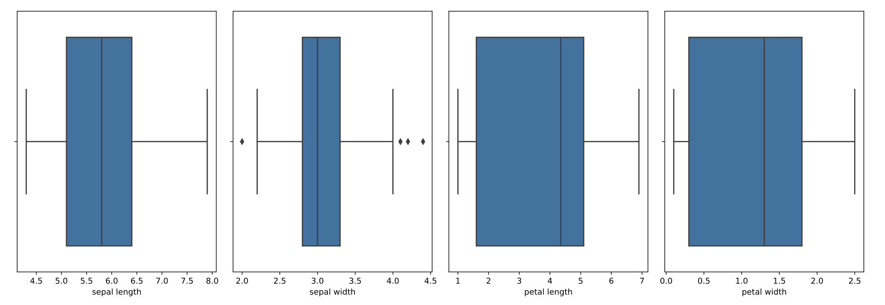

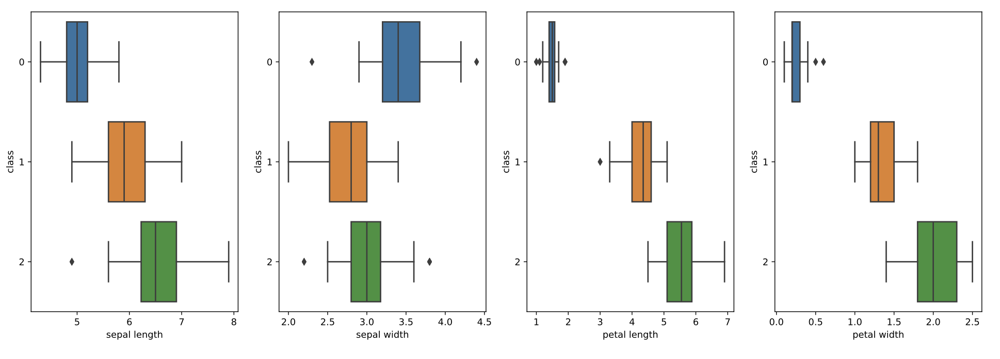

###### Histograms

```python
# df.hist(figsize=(10.0,9.0)) #using directly pandas
plt.hist(df.quality, color="g", )
```


##### Pairplots

```python
sns.pairplot(df, hue="quality", diag_kind="kde")
```


#### Supervised Learning Goals

- Design an algorithm able to forecast the values of an attribute given the values of other attributes
- In our case, guess the class given the other values

**Problem:** if i have a lot of features it is not easy to look at plots
**Answer:** we need a solution based on math 

### Entropy and information gain (IG)

**From information theory we get:**
Given a source $X$ with $V$ possible values, with probability distribution:

$$P(v_1) = p_1, P(v_2) = p_2, ..., P(v_V) = p_V$$

The best coding allows the transmission with an average number of bits given by:

$$H(X) = -\sum_{j} p_j \log_2(p_j)$$

$H(X)$ is the entropy of the information source $X$

#### Meaning

- **High entropy** means that the probabilities are mostly similar
- The histogram would be flat
- **Low entropy** means that some symbols have much higher probability
- The histogram would have peaks
- Higher number of allowed symbols (i.e. of distinct values in an attribute) gives higher entropy

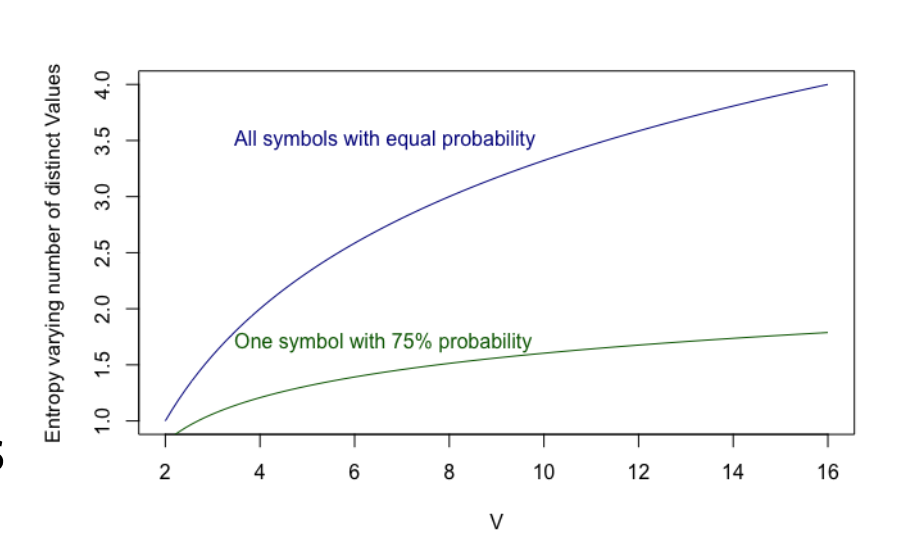

**If the source is BINARY (probabilities for the outcomes are respectively $p$ and $(1-p)$ when p is 0 or 1 the entropy goes to 0.** -> If i have 2 classes $A$ and $B$ if $P(A) = 0$ then $P(B) = 1$
#### Entropy in classification

- In classification, low entropy of the class labels of a dataset means that there is low diversity in the labels (i.e. the dataset has high purity, there is a majority class)
- We look for criteria that allow to split a dataset into subsets with higher purity
- With criteria we mean logical formulas to be used as decision function to partition the set elements into the subsets

**After split:**

Splitting the dataset in two parts according to a threshold on a numeric attribute the entropy changes, and becomes the weighted sum of the entropies of the two parts.

The weights are the relative sizes of the two parts.

Let $d \in D$ be a real-valued attribute, let $t$ be a value of the domain of $d$, let $c$ be the class attribute.

We define the entropy of $c$ w.r.t. $d$ with threshold $t$ as:

$$H(c|d : t) = H(c|d < t) \cdot P(d < t) + H(c|d \geq t) \cdot P(d \geq t)$$

#### Information Gain for binary split

It is the reduction of the entropy of a target class obtained with a split of the dataset based on a threshold for a given attribute.
We define:
$$IG(c|d : t) = H(c) - H(c|d : t)$$

It is the information gain provided when we know if, for an individual, $d$ exceeds the threshold $t$ in order to forecast the class value.

We define:
$$IG(c|d) = \max_t IG(c|d : t)$$

### Decision tree construction

A decision tree is a tree-structured plan generating a sequence of tests on the known attributes (predicting attributes) to predict the values of an unknown attribute.

**Construction Process:**
- Test the attribute which guarantees the ***maximum IG*** for the class attribute in the current data set $X$
- Partition $X$ according to the test outcomes
- Recursion on the partitioned data

### Train/Test Split

- **Training set**: used to learn the model
- **Test set**: used to evaluate the learned model on fresh data

**Procedure:**
- The split is done randomly
- Assumption: the parts have similar characteristics
- The proportion of the split is decided by the experimenter
- Common solutions: 80-20, 67-33, 50-50

**Example:**
- For a 50-50 split of the Iris dataset
- For this specific split, entropies for the class column in training and test turns out to be both 1.58
```python
from sklearn.model_selection import train_test_split
from sklearn import datasets

# Load the Iris dataset
iris = datasets.load_iris()
X = iris.data  # Features
y = iris.target  # Target variable

# Perform 50-50 train/test split with random_state = 10
X_train, X_test, y_train, y_test = train_test_split(
    X, y, 
    test_size=0.5, 
    random_state=10,
    stratify=y  # Optional: preserves class distribution
)
```

#### Buildind the decision tree (case with binary split)

### Decision tree recursion step

**Process:**
- Choose the attribute giving the highest IG
- Partition the dataset according to the chosen attribute
- Choose as class label of each partition the majority

**Recursion step:**
- Build a new tree starting from each subset where the minority is non-empty

**Observation:**
The weighted sum of the entropy of the descendant nodes is always smaller than the entropy in the ancestor node, even if one of the descendant has higher entropy (its the sum that counts).

**Termination conditions:**
- Most of the leaves are pure, recursion impossible
- One of the leaves is not pure, but no more tests are able to give positive information gain, recursion impossible
- It is labelled with the majority class, or, in case of tie, with one of the non-empty classes


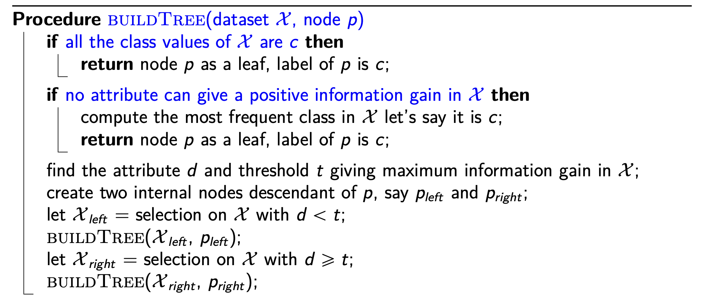
#### Training set error

- If we execute the generated decision tree on the training set itself (hiding the class to predict)
- Count the number of discordances between the true and the predicted class
- This is the training set error -> it isn't 0

**why?**

- **The limits of decision trees in general:**
	- A decision tree based on tests on attribute values can fail
- **Insufficient information in the predicting attributes**

##### Meaning
- **Error on the same data used to train the model**
- Represents the **lower limit** of expected error on new data
- We need an upper limit or more significant value for real performance

**It is better to study test set error** -> it tells us about behaviour with unseen data
### Overfitting definition

- Overfitting happens when the learning is affected by noise
- When a learning algorithm is affected by noise, the performance on the test set is (much) worse than that on the training set
#### Formal definition

A decision tree is a hypothesis of the relationship between the predictor attributes and the class.

**Definitions:**
- $h$ = hypothesis
- $error_{train}(h)$ = error of the hypothesis on the training set
- $error_X(h)$ = error of the hypothesis on the entire dataset

**Overfitting Condition:**
$h$ overfits the training set if there is an alternative hypothesis $h_1$ such that:
$$error_{train}(h) < error_{train}(h_1)$$
$$error_X(h) > error_X(h_1)$$
#### Causes for overfitting

1. **Presence of noise**
   - Bad values in predicting attributes or class labels
   - Model influenced by wrong or unusual training data

2. **Lack of representative instances**
   - Some real-world situations underrepresented in training set

A good model has low **generalization error** - works well on examples different from training data.

#### Pruning
Pruning is the way to simplify the model when you are using a decision tree.
It is the tweak of cutting some branches of the decision tree that develop too specifically over less significant features.
### Model hyperparameters

- Every model generation algorithm can be adjusted by setting specific ***hyperparameters***
- Each model has its own hyperparameters -> decision tree != SVM
- One of the hyperparameters of decision tree generation is the **maximum tree depth**
```python
from sklearn.tree import DecisionTreeClassifier

# Create decision tree with max_depth hyperparameter
model = DecisionTreeClassifier(max_depth=3)
model.fit(x_train, y_train)
```

### Purity measures for node splitting

**We need a measure for the purity of a node** - a node with two classes in the same proportion has low purity. -> Only one class = max purity

**Three common measures:**
- Entropy 
- Gini Index
- Misclassification Error -> (optional)
#### Gini Index definition

Consider a node $p$ with $C_p$ classes.

**For class $j$:**
- Frequency $f_{p,j}$
- Frequency of other classes $1-f_{p,j}$
- Probability of wrong assignment: $f_{p,j} \cdot (1-f_{p,j})$

**The Gini Index** is the **total probability of wrong classification**:
$$\sum f_{p,j} \cdot (1-f_{p,j}) = \sum f_{p,j} - \sum f_{p,j}^2 = 1 - \sum f_{p,j}^2$$

**Range:**
- Maximum value: when records are uniformly distributed over all classes: $1 - 1/C_p$
- Minimum value: when all records belong to the same class: $0$
#### Splitting based on Gini Index

When a node $p$ is split into $ds$ descendants $p_1,...,p_{ds}$:

Let $N_{p,i}$ and $N_p$ be the number of records in the $i$-th descendant node and in the root, respectively.

**We choose the split giving the maximum reduction of the Gini Index:**
$$GINI_{split} = GINI_p - \sum \frac{N_{p,i}}{N_p} GINI(p_i)$$
### Conclusion

**Computational Complexity:**
- Overall cost: $O(DN \log N)$
- Run-time classification: $O(h)$ where $h$ is tree height

**Key Properties:**
- Non-parametric approach (no distribution assumptions)
- NP-complete to find optimal DT, heuristics find sub-optimal solutions
- Robust to noise and redundant attributes
- Pruning strategy has high impact on final result

**Practical Advantages:**
- Easy to understand, implement, and use
- Best starting point for supervised learning
- Overfitting controlled by maximum tree depth
- Handles both continuous and discrete predictor attributes

### Greedy algorithms

**Decision Tree building is a greedy algorithm.**

Greedy algorithms are an **approximate family of algorithms**, belonging to the broader family of **hill-climbing algorithms**.

**Characteristics:**
- They **do not guarantee** reaching the best theoretically possible result
- At every decision point, the choice is made that guarantees the **maximum immediate gain**
- It does not take into account that a sequence of decisions may lead to the best final result even if individually they do not pass through the points of the best partial improvement


## Evaluation

To choose the best classifier we need a way to evaluate them.

### Evaluation principles

In supervised learning, the **training set performance is overoptimistic**.

We need a **lower bound for performance** obtained by independent tests.

**Supervised data are usually scarce**, we need to balance the use of them between:
- **Train**
- **Validation**: to tune the parameters (sometimes it is omitted)
- **Test**

**Evaluation goals:**
- Evaluate how much the theory fits the data
- Evaluate the cost generated by prediction errors


### Accuracy of a classifier

The **error frequency** is the simplest indicator of the quality of a classifier:
- It is the sum of errors on any class divided by the number of tested records

**Accuracy and other indicators are used to:**
- Compare different classifiers or hyperparameter settings
- Estimate the **run-time performance** we can expect, and therefore the cost of errors
  - Run-time performance = performance observed when using the trained classification model to produce value in some activity

### Hyperparameters (model selection)

Every machine learning algorithm has one or more **hyperparameters** that influence its behaviour.

It is crucial to obtain a **highly reliable estimate** of the run-time performance.

**Optimization process:**
- Several train/test loops are generally necessary to find the best set of values for the hyperparameters
- Model selection includes the selection of the learning algorithm and its optimization
- Sometimes it is necessary to find the best compromise between the optimization step and the quality of the result (some learning algorithms require long computation times)

### Testing strategies

**Goals for a good strategy:**
- Make optimal usage of the supervised data
- Be compatible with time constraints for model selection

**Key principle:** Train and test should be done using **different portions** of the supervised data available. In every step, the data should be representative of the data that will be classified at run-time.

### Holdout

- The split should be as **random as possible**
- **Stratification**: statistical sampling technique that ensures the maintenance of the proportion of classes in Training and Test sets
- The test set is used to obtain an estimation of performance measures with new data

#### Criteria for train/test split proportion

| Factor | Consideration |
|--------|---------------|
| **Small Datasets** | Allocate more data for training (80/20 or 90/10) |
| **Large Datasets** | Can reserve more data for testing (70/30 or 80/20) |
| **Simple Models** | Require less training data, can afford larger test set |
| **Complex Models** | Require more training data (90/10 or 85/15) |
| **High Variance Models** | May benefit from more training data |
| **Stable Performance** | Larger test set provides more reliable estimate |
| **Rare Events** | Use stratified sampling to ensure representation |
| **Resource Constraints** | Smaller test set might be necessary |
| **Critical Applications** | Require larger test set for robust evaluation |

### Cross validation (k-fold)

The training set is **randomly partitioned into $k$ subsets** (use stratified partitioning if necessary).

**Process:**
1. $k$ iterations using one subset for test and the others for training
2. Combine the results of tests
3. Generate the final model using the entire training set

**Optimal use of supervised data:** each record is used $k-1$ times for training and once for testing.

**Typical value:** $k = 10$

#### Cross validation – Pros and Cons

**Pros:**
- The train/test loop is repeated $k$ times
- The estimate of performance is averaged on $k$ runs → **more reliability**
- All examples are used once for testing
- Final model is obtained using all examples → **best use of examples**

### Train/validation/test – Pros and Cons

**Pros:**
- Train/validation loop is **faster** than Cross Validation
- Optimization of hyperparameters is done with the validation set, independent from final evaluation → **more reliable than simple holdout**

**Cons:**
- Test during hyperparameters optimization is done on a portion of examples (validation set) → **less reliable than Cross Validation**

### Model selection strategies summary

| Strategy | Data Usage | Hyperparameters | Reliability | Observations |
|----------|------------|-----------------|-------------|--------------|
| **Zero Level** | Entire dataset | Defaults | Not reliable | Just a first trial |
| **Quick Attempt** | Train/Test split | Defaults | Better estimation | For small datasets or time constraints |
| **Standard** | Train/Test split | Optimized ranges | Possible overestimation | Not too time consuming |
| **Train/Validation/Test** | Three-way split | Optimized ranges | Good reliability | Not good for very small datasets |
| **Cross Validation** | Train/Test + k-fold | Optimized ranges | Best reliability | Time consuming |

### The model selection process

**A wider selection process:**
- We can use different models for classification (decision tree is one of them)
- The general process implies trying several models
- For each model, find the best hyperparameters
- Use the model giving the best results with the best hyperparameters to classify new (unsupervised) data at **run-time**

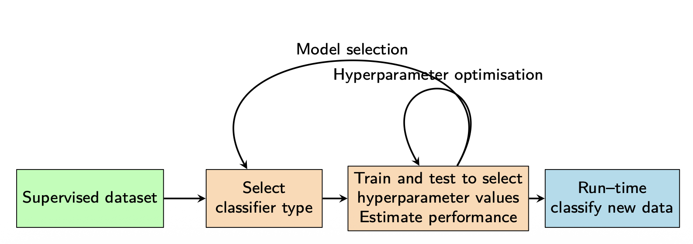

### Performance Measures for Classifiers

**Confusion Matrix**: A table used to evaluate the performance of a classification model by comparing predicted and actual class labels.
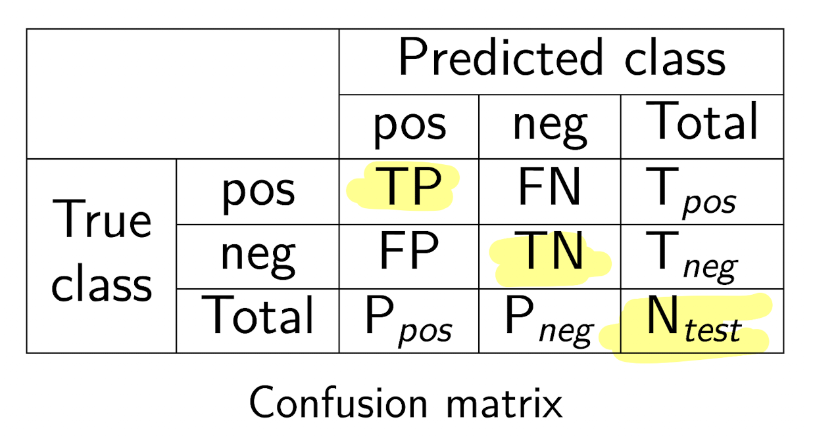

```python
from sklearn.metrics import confusion_matrix, ConfusionMatrixDisplay
import matplotlib.pyplot as plt

# Assuming y_test and y_pred are your true and predicted labels
y_pred = model.predict(X_test)

# Get confusion matrix
cm = confusion_matrix(y_test, y_pred)
print(cm)

# Visualize confusion matrix
ConfusionMatrixDisplay.from_predictions(y_test, y_pred)
plt.show()
```
## Confusion matrix metrics

$$\text{Success rate (Accuracy)} = \frac{TP + TN}{N_{test}}$$

$$\text{Error rate} = 1 - \text{Success rate}$$

|  | **Predicted class** |  |  |
|--|--|--|--|
| **True class** | pos | neg | Total |
| pos | TP | FN | $T_{pos}$ |
| neg | FP | TN | $T_{neg}$ |
| Total | $P_{pos}$ | $P_{neg}$ | $N_{test}$ |

### Is accuracy enough?

**Other possible indicators:**
- **Velocity**
- **Robustness** w.r.t. noise (i.e. training data with bad class label)
- **Scalability**
- **Interpretability**

**Classification errors can have different consequences depending on the class:**
- When forecasting an illness, a **false positive** can be less dangerous than a **false negative** (unless the cares or additional examinations are dangerous or invasive)
- Consider the cost of retiring a machinery as damaged while it is ok (false positive) vs the cost of an unpredicted failure (false negative)

### Summary of measures

$$\text{Precision} = \frac{TP}{TP + FP}$$
- The rate of true positives among the positive classifications

$$\text{Recall (Sensitivity)} = \frac{TP}{TP + FN}$$
- The rate of the positives that we can catch

$$\text{Specificity} = \frac{TN}{TN + FP}$$
- The rate of the negatives that we can catch

$$\text{F1-score} = 2 \cdot \frac{\text{precision} \cdot \text{recall}}{\text{precision} + \text{recall}}$$
- The harmonic mean of precision and recall (a.k.a. balanced F-score)

### Which measure should we use?

**Rule of thumb:**
- **Accuracy** gives an initial feeling of effectiveness, but can be **heavily misleading when classes are highly imbalanced** (considers globally all classes, also for multi-class)
- **F1-score** is always interesting because it has higher values when precision and recall are reasonably balanced
- If the costs of errors on positives and negatives are significantly different, evaluate **precision and recall** separately

### Multi-class case

The confusion matrix is easily extended when there are more than two classes:
- Each cell contains the number of test records of class $i$ predicted as class $j$
- The numbers in the **main diagonal** are the true predictions

**For three classes (a, b, c):**
- $T_i$ = true number of $i$ labels in the dataset
- $P_i$ = total number of $i$ predictions by classifier $C$
- $TP_i$ = number of true predictions for class $i$
- $FP_{i \to j}$ = number of false predictions for class $i$ predicted as $j$
### Multi-class evaluation

$$\text{Accuracy} = \frac{\sum_i TP_i}{N}$$

$$\text{Precision}_i = \frac{TP_i}{P_i} \qquad \text{Recall}_i = \frac{TP_i}{T_i}$$

**Key points:**
- Precision, recall and F1-score are intrinsically defined for a **single class**
- In binary classification they refer to the "positive" class
- In multi-class cases, scikit-learn produces an **array of values**, one for each class
- When a single value is needed (e.g. for `GridSearchCV`), an **average** is required

#### Averaging methods

For measure $f$ across classes $c_i \in C$, each with frequency $C_i$:

| Method | Formula | Description |
|--------|---------|-------------|
| **Macro** | $f(C) = \frac{\sum f(c_i)}{C}$ | Each class has **equal impact** |
| **Weighted** | $f(C) = \frac{\sum f(c_i) \cdot C_i}{C}$ | Classes influence **proportionally to size** |
| **Micro** | Computed globally across all samples | See formulas below |

**Micro average formulas:**
$$\text{precision}_{micro} = \frac{\sum TP_i}{\sum (TP_i + FP_i)} $$ 
$$\text{recall}_{micro} = \frac{\sum TP_i}{\sum (TP_i + FN_i)}$$

$$\text{F1}_{micro} = \frac{2 \cdot \text{precision}_{micro} \cdot \text{recall}_{micro}}{\text{precision}_{micro} + \text{recall}_{micro}}$$

#### When to use each averaging method

| Method | Use when | Examples |
|--------|----------|----------|
| **Micro** | Class imbalance is not a concern; evaluating overall system performance | Search engines, medical diagnosis |
| **Macro** | All classes should be treated equally, even with imbalance | Sentiment analysis, rare disease detection |
| **Weighted** | Class imbalance exists and larger classes should influence more | Spam filtering, customer churn prediction |
### Cohen's Kappa statistic

Evaluates the **concordance between two classifications** (in our case between the predicted and the true one).

**Fraction of concordance observed:**
$$Pr(o) = \frac{TP_a + TP_b + TP_c}{N}$$

**Expected fraction of concordance for random assignment:**
$$Pr(e) = \frac{T_a \cdot P_a + T_b \cdot P_b + T_c \cdot P_c}{N^2}$$

**Kappa** is the ratio between the concordance exceeding the random component and the maximum surplus possible:
$$\kappa = \frac{Pr(o) - Pr(e)}{1 - Pr(e)} \qquad -1 \leq \kappa \leq 1$$

#### Cohen's Kappa for binary classification

$$\kappa = \frac{2 \times (TP \times TN - FP \times FN)}{(TP + FP)(FP + TN) + (TP + FN)(FN + TN)}$$

**Range of $\kappa$:**
- **1**: Perfect agreement ($TP_a + TP_b + TP_c = N$)
- **-1**: Total disagreement (perfect swap between predictions and true labels; only possible with 2 classes if all have non-zero counts)
- **0**: Random agreement

### Matthews Correlation Coefficient (MCC)

A metric for evaluating binary classifications, especially effective when **classes are imbalanced**. It measures the correlation between observed and predicted classifications.

$$MCC = \frac{TP \times TN - FP \times FN}{\sqrt{(TP + FP)(TP + FN)(TN + FP)(TN + FN)}}$$

**Properties:**
- **Range:** $-1$ to $1$
  - **1**: Perfect prediction
  - **0**: Prediction no better than random
  - **-1**: Complete disagreement
- **Balanced evaluation**: Particularly useful for imbalanced datasets since it accounts for all components of the confusion matrix

---

### The cost of errors

Our decisions are driven by predictions → **bad predictions imply a cost**.

**Examples:**
- Granting a loan to a bad payer costs more than denying a loan to a good payer
- A false "oil spill" alarm is less expensive than an undetected spill
- A wrong "fault prediction" in an industrial plant is generally less expensive than an unexpected fault
- In direct marketing, sending advertisement without redemption is less harmful than ignoring a promising customer

### Cost sensitive learning

**Goal:** Weight the errors to account for different costs of misclassification.

**Alternative 1: Alter class proportions**
- Duplicate examples for which the classification error cost is higher
- The classifier becomes more able to classify the costly classes correctly
- Also useful when classes are **imbalanced** (frequencies of class labels in $X$ are not equal)

**Alternative 2: Add weights to instances**
- Some learning schemes allow instance weighting
- Example: `DecisionTreeClassifier` in scikit-learn has the `class_weight` hyperparameter:
  - Define a dictionary with one key per class specifying the relative weight
  - The `'balanced'` option balances classes automatically

```python
from sklearn.tree import DecisionTreeClassifier

# Option 1: Manual weights
model = DecisionTreeClassifier(class_weight={0: 1, 1: 10})

# Option 2: Automatic balancing
model = DecisionTreeClassifier(class_weight='balanced')
```
### Predicting probabilities of classes

Many classifiers produce, rather than a class label (**crisp prediction**), a tuple of probabilities, one for each possible class (**probabilistic** or **soft prediction**).

**When to use each:**
- **Crisp output**: When an immediate decision is required
- **Probabilistic output**: When classification is part of a process including several evaluation/action steps

#### Crisp values sometimes hide probabilities

When a leaf of a decision tree has non-zero counts for minority classes, probabilities can be assigned based on the fractions of training data elements in that leaf belonging to each class.

*Note: Since leaves often have small numbers of examples and/or minority classes with frequencies near zero, **smoothing techniques** are used to adjust the probabilities.*

#### Converting probabilities to crisp values

| Case | Technique |
|------|-----------|
| **Binary** | Set a threshold for the positive class |
| **Multiclass** | Output the class with the maximum probability |

---

### Lift chart (binary classification)

Used to evaluate various scenarios depending on the application.

**Process:**
1. Apply a probabilistic classification scheme to a dataset with positives
2. Sort all classified elements by **decreasing probability** of positive class
3. Create a chart with axes: $x$ = sample size, $y$ = number of positives in sample

*Only the **rank** is important, not the specific probability.*

#### Cumulative Gains chart

- The **straight line** plots the number of positives obtained with a **random choice** of a sample
- The **curve** plots the number of positives obtained drawing a fraction of test data with **decreasing probability**
- The **larger the area** between the two curves, the **better** the classification model

#### Lift chart

For each fraction of data (with decreasing probability of positivity), shows a **multiplication factor** of the likelihood of positivity with respect to random choice.

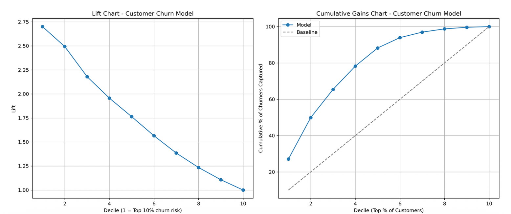

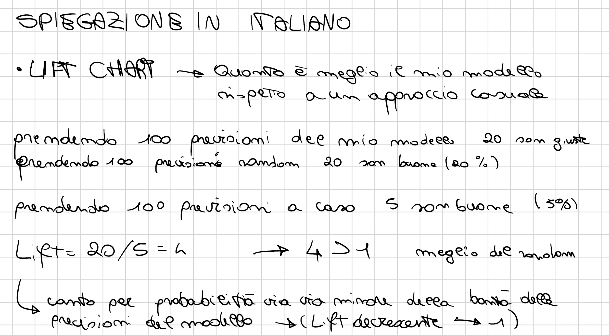


## Naive bayes classifier

### Main issues

* Based on **statistics**, in particular, on **Bayes' theorem**.
* Considers the contribution of **all the attributes**.
* Assumes that each attribute is **independent** from the others, **given the class** ${}^1$.
    * This is a very **strong assumption**, rarely verified, but, nevertheless, the method works!
* Estimate the probabilities with the **frequencies**, as usual.

> ${}^1$ This means $P(d_1 = v_1, d_2 = v_2 | c = c_x) = P(d_1 = v_1 | c = c_x) \cdot P(d_2 = v_2 | c = c_x)$


---

## Statistical modeling – Naive bayes classifier: a fictitious example

### The weather/play data

| Play | yes | no | Total | Fraction |
| :--- | :--- | :--- | :--- | :--- |
| | 9 | 5 | 14 | 9/14, 5/14 |

| Attribute | Value | yes | no |
| :--- | :--- | :--- | :--- |
| **Outlook** | sunny | 2 | 3 |
| | overcast | 4 | 0 |
| | rainy | 3 | 2 |
| **Temperature** | hot | 2 | 2 |
| | mild | 4 | 2 |
| | cool | 3 | 1 |
| **Humidity** | high | 3 | 4 |
| | normal | 6 | 1 |
| **Windy** | false | 6 | 2 |
| | true | 3 | 3 |

---

### Numbers of cases and fractions of the Weather/Play dataset

| Attribute | Value | Fraction (yes) | Fraction (no) |
| :--- | :--- | :--- | :--- |
| **Outlook** | sunny | 2/9 | 3/5 |
| | overcast | 4/9 | 0/5 |
| | rainy | 3/9 | 2/5 |
| **Temperature** | hot | 2/9 | 2/5 |
| | mild | 4/9 | 2/5 |
| | cool | 3/9 | 1/5 |
| **Humidity** | high | 3/9 | 4/5 |
| | normal | 6/9 | 1/5 |
| **Windy** | false | 6/9 | 2/5 |
| | true | 3/9 | 3/5 |

---

### A new sample needs classification

* **Outlook:** sunny, **Temperature:** cool, **Humidity:** high, **Windy:** true, **Play:** ?
* Treat the five features and the overall likelihood that **play** is **yes** or **no** as equally important.
    * They are independent pieces of evidence; the overall likelihood is obtained by **multiplying the probabilities** (i.e., the frequencies).

$$\text{likelihood of yes} = \frac{2}{9} \cdot \frac{3}{9} \cdot \frac{3}{9} \cdot \frac{3}{9} \cdot \frac{9}{14} \approx 0.0053$$

$$\text{likelihood of no} = \frac{3}{5} \cdot \frac{1}{5} \cdot \frac{4}{5} \cdot \frac{3}{5} \cdot \frac{5}{14} \approx 0.0206$$

* **Normalize to 1**:

$$P(\text{yes}) = \frac{0.0053}{0.0053 + 0.0206} \approx 20.5\%$$

$$P(\text{no}) = \frac{0.0206}{0.0053 + 0.0206} \approx 79.5\%$$

* **no** is more likely than **yes**, about four times.

---

## Statistical modeling – Naive bayes classifier: the bayes method

### The Bayes' theorem

Given a **hypothesis** $H$ and an **evidence** $E$ that bears on that hypothesis:

$$P(H | E) = \frac{P(E | H) P(H)}{P(E)}$$

* The hypothesis is the **class**, say $c$, the evidence is the **tuple of values** of the element to be classified.
* We can split the evidence into pieces, one per attribute, and, if the attributes are **independent** inside each class:

$$P(c | E) = \frac{P(E_1 | c) \cdot P(E_2 | c) \cdot P(E_3 | c) \cdot P(E_4 | c) \cdot P(c)}{P(E)}$$

---

### The Naive Bayes method

* Compute the **conditional probabilities** from examples.
* Apply the theorem.
* The **denominator** $P(E)$ is the same for all the classes and is eliminated by the **normalization** step.
* It is called **naive** since the assumption of independence between attributes is quite simplistic.
* Nevertheless, it works quite well in many cases.

---

### Problem

What if value $v$ of attribute $d$ never appears in the elements of class $c$?

* In this case $P(d=v | c) = 0$.
* This makes the probability of the class for that evidence **drop to zero**.
* In practice, this case is quite common, in particular in a domain with many attributes and many distinct values.
* An **alternative solution is needed**.

---

### Values not represented in a class – Laplace smoothing

* $\alpha$ – **Smoothing parameter**, typical value is **1**.
* $af(d=v_i, c)$ – **Absolute frequency** of value $v_i$ in attribute $d$ over class $c$.
* $V$ – **Number of distinct values** in attribute $d$ over the dataset.
* $af(c)$ – **Absolute frequency** of class $c$ in the dataset.

$$\text{Smoothed frequency } sf(d=v_i, c) = \frac{af(d=v_i, c) + \alpha}{af(c) + \alpha V}$$

* With $\alpha=0$ we obtain the standard, unsmoothed formula.
* Higher values of $\alpha$ give more importance to the **prior probabilities** for the values of $d$ w.r.t. the evidence given by the examples.
  
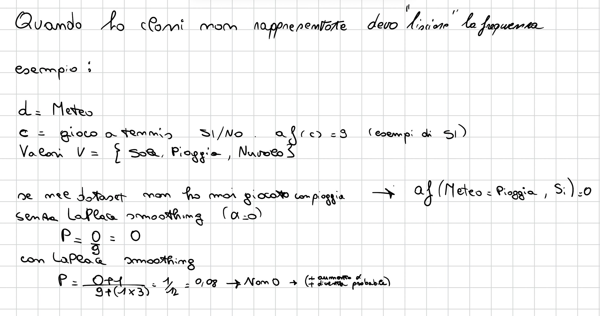
---

## Statistical modeling – Naive bayes classifier: missing values

### Missing values

* They **do not affect the model**, it is not necessary to discard an instance with missing value(s).

* **Test instance:**
    * The calculation of the likelihood simply **omits this attribute**.
    * The likelihood will be higher for all the classes, but this is compensated by the **normalization**.

* **Train instance:**
    * The record is simply **not included in the frequency counts** for that attribute.
    * The descriptive statistics are based on the number of values that occur, rather than on the number of instances.

### Missing Values in Naive Bayes

**General Rule:** Missing values do not affect the model; no need to discard instances.

**For Test Instances:**
- Calculation of likelihood omits the missing attribute
- Higher likelihood for all classes, compensated by normalization

**For Train Instances:**
- Record not included in frequency counts for that attribute
- Descriptive statistics based on number of values that occur, not number of instances

---

### Numeric Values in Naive Bayes

**Approach:** Frequency-based method inapplicable; assumes Gaussian distribution.

**Calculation:**
- Compute mean ($\mu$) and variance ($\sigma^2$) for each numeric attribute per class
- Use Gaussian probability density function:

$$f(x) = \frac{1}{\sqrt{2\pi}\sigma}e^{-\frac{(x-\mu)^2}{2\sigma^2}}$$

**Important Notes:**
- Probability density ≠ probability (probability of exact value in continuous domain is zero)
- Density value represents probability variable lies in small interval around that value
- Precision factor same for all classes, so can be disregarded
- If numeric values missing, mean and standard deviation based only on present values

### The Linear Perceptron

Often called also artificial neuron

In practice, a linear combination of weighted inputs

---

### Linear Classification with the Perceptron

Separate examples of two classes

For a dataset with numeric attributes

Learn a hyperplane such that all the positives lay on one side and all the negatives on the other

---

### The Hyperplane

The hyperplane is described by a set of weights $w_0,...,w_D$ in a linear equation on the data attributes $x_0,...,x_D$

The fictitious attribute $x_0 = 1$ is added to allow a hyperplane that does not pass through the origin

There are either none or infinite such hyperplanes

$$w_0 \cdot x_0 + w_1 \cdot x_1 + ... + w_D \cdot x_D \begin{cases} >0 & \Rightarrow \text{positive} \\ <0 & \Rightarrow \text{negative} \end{cases}$$

---

### Training the Perceptron

**Learning the hyperplane**

**Algorithm 1: Perceptron learning of a separating hyperplane**

**Data:** Training set $X = \{(x_i, y_i)\}$  
**Result:** Weight vector $w$ defining the hyperplane

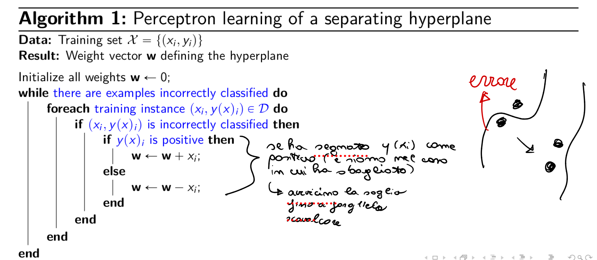
---

### Linear Perceptron Convergence

Each change of weights moves the hyperplane towards the misclassified instance, consider the equation after the weight change for a positive instance $x_i$ which was classified as negative:

$$(w_0 + x_{i0}) \cdot x_{i0} + (w_1 + x_{i1}) \cdot x_{i1} + ... + (w_D + x_{iD}) \cdot x_{iD}$$

The result of the equation is increased by a positive amount:

$$x_{i0}^2 + ... + x_{iD}^2$$

Therefore the result will be less negative or, possibly, even positive

Analogously for a negative instance which was classified as positive

---

### Linear Perceptron Algorithm Termination

The corrections are incremental and can interfere with previous updates

The algorithm converges if the dataset is linearly separable, otherwise it does not terminate

For practical applicability it is necessary to set an upper bound to the iterations